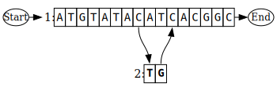
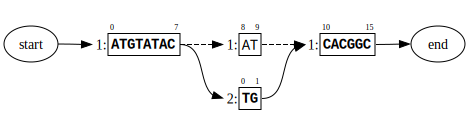

# Gen
Gen is a version control system for genetic sequences. It efficiently stores genome-length sequences and sequence
variations, with native support for polyploid genomes and pooled genotypes. Each project is organized into a repository,
where collections of sequences and associated data are stored and tracked over time. Within a repository, branches can
be created to explore different modifications or variations without affecting the main project. These branches can later
be merged to integrate results from different experiments or collaborators.

The gen client can import standard sequence file formats from sources like NCBI and genetic design tools. The sequence
model takes the form of a graph structure as shown in the figure below. Each molecule is made up out of a network of
_nodes_ that represent sequence fragments, and _edges_ that define how sequence fragments are connected. Multiple
molecules are organized into _collections_ that could represent the different chromosomes in a cell or DNA in a reaction
mixture. Molecules generally start out as a node that holds the reference sequence, and new edges and nodes are
added for every sequence variant that is designed or observed. To reconstitute a linear sequence, the client walks from
node to node along a defined _path_. This data model allows the representation of a wide range of biological complexity
-- from a single molecule to complex cultivars and cell lines, including any naturally occurring variation in addition
to intended engineering.



**_Figure 1_**:_Block graph model representation of a sequence variant where two nucleotides AT are replaced by TG;
the modified sequence (shown in bold) is stored as a path over a list of edges that address specific coordinates._

The block graph model is designed to be additive: new sequence variants only add to the graph, existing nodes are stable
and do not have to be split to accomodate the new topology. This is different from the more commonly used segment graph 
model shown in Figure 2, and gen automatically converts between formats as needed. 



**_Figure 2_**:_Segment graph model corresponding to the sequence variant in Figure 2. The original sequence was
split into 3 parts; the modified sequence path is defined by a list of nodes that refer to these segments. Nodes are
labeled by their parent ID and starting coordinate, new edges internal to the reference are shown as dashed arrows._ 

Individual chromosomes or contigs are stored as _block groups_ that refer to a specific grouping of edges from the main
graph. Block groups are adressed on three facets: name, sample, and collection. The name is an identifier like
"chromosome II", and the sample could refer to a real individual or a virtual outcome of an experiment. The meaning of a
collection is flexible, and for example could refer to the type of data (genomic, protein, ...) or experiment.

<!--Rewrite this entirely (center around blockgroups)

Paths can also be compared to one another to detect features that are common or different between sets of paths, which
can be used to analyze experimental data. Another way to use gen to analyze experiments is through _sample_ objects. A
gen sample assigns probabilities to edges and paths based on the frequency they are observed in a physical sample. These
numbers can be derived from sequencing results, or set by the user to represent an isolate or cloning reaction. This
allows a user to mask out the edges that are not present in a sample and focus on the distinguishing features. The
figure below demonstrates how this can be used to represent a polyploid genome obtained through cross-breeding. Like
paths, samples can be compared to one another to detect differences and common features

`<figure 2>`
-->

## Installing from Source
Make sure you have a Rust compiler installed on your system. You can install the Rust toolset using the [rustup
installer](https://rustup.rs/).


1. Clone the [source](https://github.com/ginkgobioworks/gen) with `git`:

   ```sh
   git clone https://github.com/ginkgobioworks/gen.git
   cd rust
   ```

2. Compile the gen package and its dependencies:

    ```
    cargo build --release
    ```

3. You can find the gen executable in ./target/release/ or execute it via cargo:

    ```
    cargo run -- <arguments>
    ```

To cross-compile gen to run on a different architecture, you need to first add a target to the Rust toolchain and
install a linker. For macOS to Linux this can be done as follows:

    ```
    rustup target add x86_64-unknown-linux-gnu
    brew install SergioBenitez/osxct/x86_64-unknown-linux-gnu
    cargo build --release --target=x86_64-unknown-linux-gnu
    ```

The executable will be placed in ./target/x86_64-unknown-linux-gnu/release/

## Usage

### Starting a new repository
`gen --db <file> init`

<!-- Importing sequence files into a collection -->

`gen --db <file> import --fasta <file> --name <string>`

### Cloning an existing repository
<!-- -Exporting sequence files and slices -->
<!-- -Shallow checkout -->
<!-- -Exploring a repository: listing collections, samples, paths (molecules) -->
<!-- -Translating coordinates between paths -->

### Recording sequence changes
<!-- From a VCF file -->
Sequence variants observed through NGS can be imported into a gen repository via standard VCF file obtained from variant
callers like Freebayes, GATK, or DeepVariant. [...]
<!-- -From a sequence file that was edited externally -->

<!-- -From the gen command line -->

<!--

Inserting one or more genetic parts at a specific locus can be done using the `gen update <location> <sequence>` command. The location parameter is given as the combination of a path (molecule) identifier and a numerical coordinate referenced to that path, separated by a colon. If the option `--propagate` is used, all other paths that include the location will be updated as well. By default the molecule itself is changed, but by using the option `--new` new molecules are created and their path IDs are returned to the user. Multiple inserts can be specified using the `--fasta <file>` argument. In this case new path IDs are always returned to the user, but unless the option `--new` is given the original path is removed.

To insert multiple parts successively in the same location, use the option `--combinatorial <file>` with a CSV file where each column represents a slot within the target position, and the rows list which parts can be introduced in that slot, as specified by their identifiers from the fasta file. By default a full factorial design will be generated, but the option `--associations <file>` allows you to restrict the experimental design to the combinations listed as individual rows, with columns still corresponding to the same slots. Columns that are left empty are treated as being full factorial. The option `--anti-associations <file>` provides the inverse functionality: a similar csv file is provided, but each row represents genetic that should not occur together as combinations.

-->

### Associating numerical data with paths and edges
<!-- -From CSV referencing named paths -->

<!-- -From mapped sequencing reads -->

### Commits and merges
<!-- -Local only for now -->


