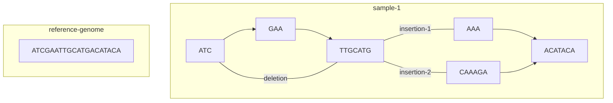

Indexing into a graph is one of the most challenging parts of working with graph genomes. As an example, take the following
reference genome with variants found in a sample:

Now, suppose we want to perform engineering on sample-1 and wish to carry out an insertion at the `CATA` position. How
can this position be addressed using the linear coordinate space? Because each chromosome's path is a different length due
to variants, there is no common reference frame for this position. To try and address this issue, the following
conventions are used.

* If the region is not altered, the base genome can be referenced explicitly. For example, within sample-1, `CATA` can 
be referenced as position 15-19 as that region is not impacted by any variants.
* If the organism has a single copy of the genetic material, sample-1 can be accessed assuming all variants have been
incorporated. Thus, if the reference genome has an `A` at position 100 and there is a 1 basepair deletion at position 90,
in sample-1, that position can be referenced 
* To refer to positions within alterations where no unambiguous coordinate system exists, `accessions` can be utilized 
to provide named regions for modifications. Coordinates within accessions are relative to the accession itself. 
Therefore, if we named the `CAAGA` insertion as `insertion-2`, the name `insertion-2:3-5` would refer to positions `AG`.

Mutability
----------

Changes made in this manner will mutate the graph for a given sample, thus operations will not be communitive. For 
instance, if we have sequence `ATCG` and insert `AA` at position 2 to make it `ATAACG`, a subsequent insertion at
position 3 will not reference the `G` in `ATCG`, but the `A` in `ATA`. For a given set of changes (such as a single
vcf file), the coordinate scheme will be consistent. For instance, if the previous 2 changes were in the same update
batch, 3 will refer to `G` in `ATCG`. But if the changes were split into 2 operations, the second case would apply.
