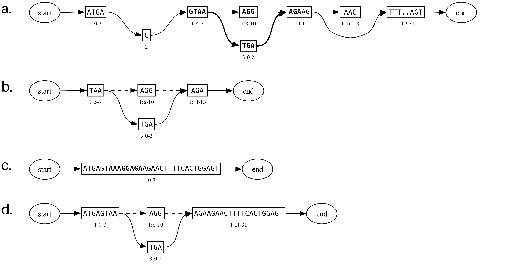
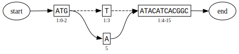
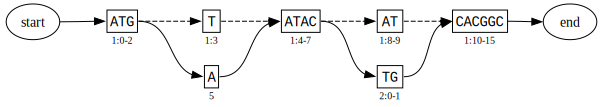
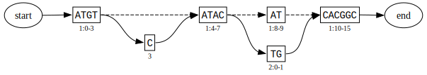
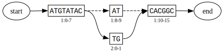

# Graph Operators

_Build_ and _derive_ operations work purely with graphs - they take graphs as input and produce new graphs as output, unlike update operations which incorporate external data. The fundamental difference between build and derive lies in how they handle sequence relationships: build operations create new independent graphs by joining, replacing, or dividing sequences, while derive operations maintain a shared reference backbone across all input and output graphs, preserving the context of variants within the original sequence framework.

## Derive
### Detach

Pangenome graphs can get rather big and unwieldy, but using the detach operation we can extract a specific region to work on, and later on merge back into the complete sequence. The first panel in the figure below represents a sequence in which an insertion, substitution, and deletion has taken place. We want to extract just the region indicated in bold, which is defined by two linear coordinates on a path, or a gen accession.

In this case we have a sample S1, which contains a sequence graph with the name 'chr1'. Our region can be accessed through the reference path of chr1, so we don't have to specify a path-name. More precisely: `--region chr1:5-12` refers to positions 5 to 12 on the designated reference path of the graph with the name chr1. If we wanted to use a different path on chr1, we would also use the `--path-name` argument (in addition to the sample and region). Lastly, we add `--new-sample S2` because we want to create a new sample S2 instead of modifying sample S1. 

```console
gen derive --detach --sample S1 --region chr1:5-12 --new-sample S2
```

Upon receiving this command, gen creates a new graph in which the start and end pointers have been moved, and only the nodes and edges
reachable between the new start and end points are retained. In this case that means that the edges to node 3 are clipped,
as well as any implicit internal edges that are no longer relevant.


 

**_Figure 1_**: _..._

### Attach

### Union
A graph merge operation is performed by taking the union of their edges, and any resulting new blocks are calculated on the fly.
Let's start out with the graph shown in Figure 3, and merge it with graph shown in Figure 2.



This results in the figure shown below. You can see that the node with ID 1 has been split into new blocks to accomodate
the merged graph, but not introduce more internal edges than necessary.




### Intersect
The complementary operation to a union, is to retain only the edges that are present in both, i.e. the intersection. 



**_Figure 5_**: _..._



### Difference

## Build

### Stitch

### Splice

### Split

### Circularize