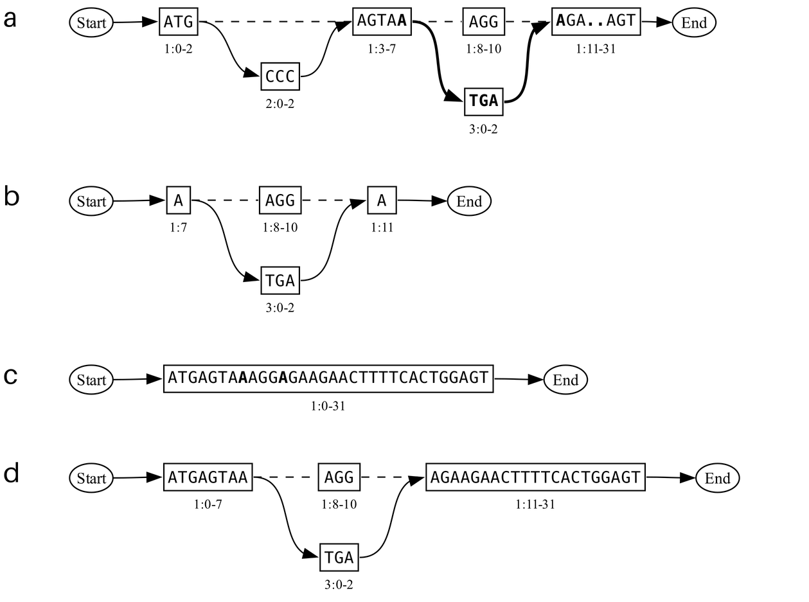
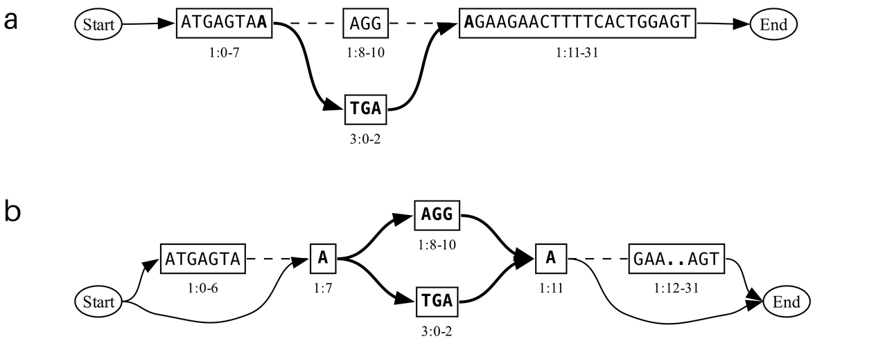

# Graph Operators

_Make_ and _derive_ operations work purely with graphs - they take graphs from the database as input and produce new
graphs as output, unlike update operations which incorporate external data. The fundamental difference between _make_
and _derive_ lies in how they handle sequence relationships across their inputs and outputs: _make_ operations create
graph objects by making new connections between distinct sequence graphs, whereas _derive_ operations take place within
a common reference backbone. For example: when you derive the intersection of sequence variants of chromosome I across
experimental samples to study the impact of evolved mutations, you still end up with an object that represents
“chromosome I”. In contrast, stitching together a set of engineered enzyme variants and a library of secretion tags is
an operation in which you have distinct input objects (“enzyme¨ and “secretion tag”) and end up with a single object
that represents a diversity of secreted enzymes. This is not intended to be strict rule, and there are examples where
the line blurs: for example, splitting a computationally designed chromosome into chunks for synthesis, and then
stitching them together is a workflow that arguably takes place entirely within the sequence context of the chromosome,
yet those are still considered to be _make_ operations. Likewise, while there is a certain directionality to the intent
of _derive_ and _make_ operations (respectively analysis and desig of experiments), users should feel empowered to
combine operations as needed.

## Make

### Chunks
A sequence graph can be split into pieces to enable a synthesis or cloning campaign using the `make chunks` subcommand
as follows:

`gen make chunks chr1 --positions 100,200,300 —-overlap 20 left`


Gen graphs generally have a designated path that serves as a linear backbone to which variants are referenced. An error
will be raised if this path is absent.

```console
gen make chunks <name> [options]
        Divide a sequence graph into multiple parts at specified positions, with or without overlap,
        resulting in distinct output objects. 


        Options:
            --chunksize <n>                
            --positions <n1,n2..>  
            --sample <sample>      Sample that contains the sequence graph to be split (mandatory if ambiguous)
            --backbone <path>      Interpret breakpoint positions in the reference frame of the given path  
            --overlap <n>          Create n bp overlap between fragments
            --overlap <n> left     Put overlap region in left fragment (default)
            --overlap <n> right    Put overlap region in right fragment
            --overlap <n> both     Keep overlap region in both fragments
            --new-names <file>      
            --prefix <string>      
            --new-sample <sample>
            --force                Allow splitting at breakpoints in variable region
            --strict               Fail if variants present in overlap regions
```

<figure style="margin-left: auto; margin-right: auto">

<figcaption width=800><b>Figure x</b>:</figcaption>
</figure>

<figure style="margin-left: auto; margin-right: auto">

<figcaption width=800><b>Figure x</b>:</figcaption>
</figure>

### Stitch
The stitch operation provides a general-purpose representation of molecular cloning workflows in a graph sequence model.
Supporting specific protocols like Gibson assembly for example is considered out of scope for the gen client, but users
are encouraged to leverage gen for the underlying primitives. 

`gen build stitch --samples S1,S2,... --new-sample Sx --overlap 20`

<figure  style="transform: scale(0.75)" >

<figcaption><b>Figure X</b>:</figcaption>
</figure>


### Splice
Deletion, integration, substitution


### Circularize
TBD

## Derive

### Union
The `derive union` command combines variants across samples by deriving the union of the sequence graphs they contain.
This is used to merge experimental results or library designs into samples that can be handled and tracked as a unit.
Graph unions also allow researches to model biological processes like a cross between two individuals. The combined
sequence graph represents all possible allele combinations, and can be used to align sequencing reads for instance.

Sequence graphs with a common name across the input samples are merged by combining their nodes and edges. For example,
if both samples contain just 'chr1', the output sample will comprise a single sequence graph that represents all
variants of 'chr1'. If the input samples contain sequence graphs with different names, the output sample will contain
multiple sequence graphs. For example, the union of sample 'S1' which contains 'chr1', with 'S2' containing 'chr2'
results in a sample that contains both 'chr1' and 'chr2'.


```console
gen derive union <sample 1> <sample 2> [<sample n>] [options]
        Combines the contents of multiple samples, merging sequence graphs based on their name.


        Options:
            --new-sample <sample>
            --subset <sequence graph name>
            --scaffold <sample> 
```


### Intersection


The complementary operation to a union, is to retain only the edges that are present in both, i.e. the intersection. 

<figure style="margin-left: auto; margin-right: auto">

<figcaption width=800><b>Figure x</b>:</figcaption>
</figure>

```console
gen derive intersection <sample 1> <sample 2> [<sample n>] [options]
        Computes the intersection between multiple samples


        Options:
            --new-sample <sample>
            --subset <sequence graph name>
            --scaffold <sample> 
```

### Difference

<figure style="margin-left: auto; margin-right: auto">

<figcaption><b>Figure x</b>:</figcaption>
</figure>

```console
gen derive difference <sample 1> <sample 2> [<sample n>] [options]
        Computes the difference between multiple samples


        Options:
            --new-sample <sample>
            --subset <sequence graph name>
            --scaffold <sample> 
```


### Subgraph
Pangenome graphs can get rather big and unwieldy, but by deriving a subgraph we can extract a specific region to work on
in a sequence editor, and later on merge it back into the complete sequence. Because a subgraph does not include edges
and nodes that are no longer relevant to the user, it can be exported to a file that is much smaller in size and is
generally easier to visualize or edit. To illustrate, the first panel in Figure 1 represents a sequence in which an
insertion and substitution have taken place. We want to take a closer look at the region indicated in bold, and use the
`derive subgraph` command as follows:

```console
gen derive subgraph —-sample S1 —-region chr1:7-12 —-new-sample my_locus
```

The region string can be read as “the sequence from position 7 through 12 (but not including 12) on the main linear path
of the graph with the name chr1”. An error will be raised if the sequence graph does not have a designated path. If we
wanted to use a different path on chr1, we would also specify the name of that path as `—-backbone` argument along with
the region.  It must be noted that even though the region definition is linear, the derived subgraph is not. Instead,
the ends of the region induce a subgraph consisting of all the blocks and edges that can be accessed by walks between
both points. Any edges to or from blocks that are outside of the subgraph will be rewritten to edges to the end and
start dummy nodes, respectively. 

Alternatively, users can specify the boundaries directly by entering a pair of block identifiers using the
`—-start-block` and `—-end-block` options. Block identifiers can be obtained from visualizations or exported GFA files,
where they take the role of segment names. They currently follow the format `m.n`, where m and n refer to the node ID in
the sequence graph, and starting coordinate of the block on that node, respectively. This ensures consistency between
multiple versions of the sequence graph, since node IDs do not change when new blocks are created. The end coordinate of
the block can be derived from its length, but this may be made explicit in the future if advantageous (for example
`m.n.l` where l is equal to the block length). Blocks are not stored in the database directly, but are instead inferred
from nodes and edges as needed. This also means that a block does not have to exist _a priori_ when specifying a start
or end block to create the subgraph.

Lastly, users can define a subgraph through a named accession instead. An accession also defines a part of the graph
through coordinates on a linear path, but they are stored by name in the gen database. and referenced through the
`-—accession` option of the extract command. The accession does not have to be defined in the sample from which you
derive a subgraph, it is automatically translated from the coordinate frame of the sample in which it was originally
defined. This is only possible if the graphs are related trough the sample lineage, and an error will be raised if they
are not.

The `--sample` option specifies which sample to take a subgraph from, it is required if the repository contains multiple
samples of the target sequence graph. In the example above we also use the `—-new-sample` option to create a new sample
called 'my_locus' for the output, otherwise gen will edit the original sample instead. While we could always roll back
to the previous sample, it can still be useful to create a new sample and keep the original sample as a reference
scaffold. As long as the bases (or residues) at the very ends of the subgraph remain intact, edited subgraphs can be
easily imported and re-attached to a larger scaffold graph using the `derive supergraph` command.

By default, subgraphs retain the name of their parent graph: the graph contained in the 'my_locus' sample created by the
example command above is still called 'chr1', since it can be seen as a window into the 'chr1' sequence. If you want to
include the extracted subgraph as part of a synthetic design, however, it can be useful to save the subgraph itself
under a new name using `--new-name`. This complicates the use of other 'derive' operations later on, but makes it
possible to use a subgraph in 'make' operations.

### Supergraph
Extracted subgraphs and their descendants can be (re)attached to the sequence graph they were derived from, or any graph
that shares at least the boundaries of the subgraph. This is done using the supergraph operation and a scaffold sample
that represents the original context. First, the boundary blocks of the input graph are used to induce an analogous
subgraph in the scaffold sample. Like in the subset operation, this subgraph consists of all blocks and edges that can
be visited between the given boundaries. Whereas the `derive subgraph` command extracts a subgraph and discards the
surrounding blocks, `derive supergraph` discards the induced subgraph and adds the surrounding blocks and edges to the
input graph. The listing below demonstrates how to use it:

``` console
gen derive supergraph —-sample my_locus —-scaffold S1 —-new-sample S2
```

This command restores the sequence context of the 'my_locus' sample using sample 'S1' as base, and saves the result as a
new sample 'S2'. The scaffold sample 'S1' remained unchanged when deriving the supergraph, and by using the
`--new-sample` option the input sample is retained as well. Note that the scaffold sample can contain more than one
sequence graph, for example to represent multiple chromosomes; all of these will end up in the supergraph output sample.

<figure style="margin-left: auto; margin-right: auto">

<figcaption width=800><b>Figure X</b>: a) DNA sequence graph representing the insertion of the trinucleotide CCC, and a 
substitution of AGG by TGA; the section we wish to extract as subgraph is indicated in bold. Numbers below the blocks 
indicate the gen node id and corresponding coordinate range. b) Extracted subset, note terminal blocks with nucleotides 
A and A. c) Scaffold graph with the terminal blocks from panel b highlighted in bold. d) Supergraph created from the 
subgraph in panel b and the scaffold in panel c.</figcaption>
</figure>

Even though the union and superset operations both provide a means to merge sequence graphs, they cannot be used
interchangeably as illustrated in Figure X

<figure style="margin-left: auto; margin-right: auto">

<figcaption width=800><b>Figure x</b>:</figcaption>
</figure>


