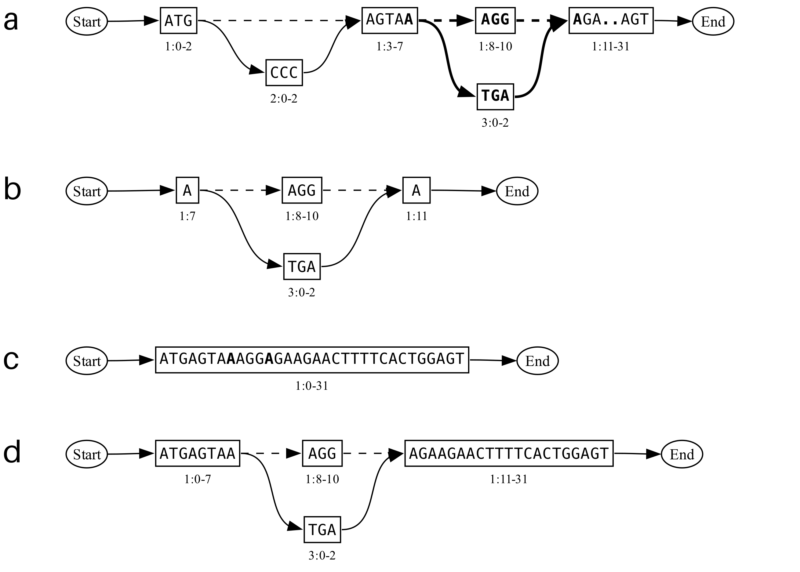
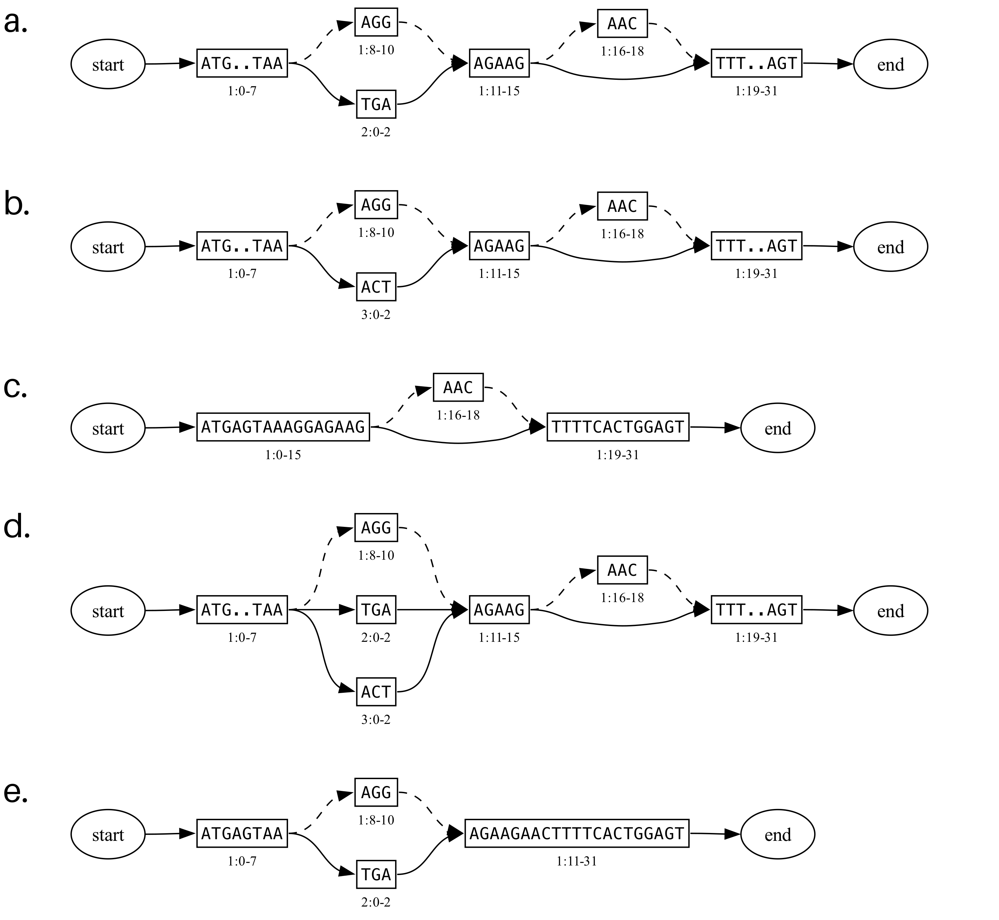
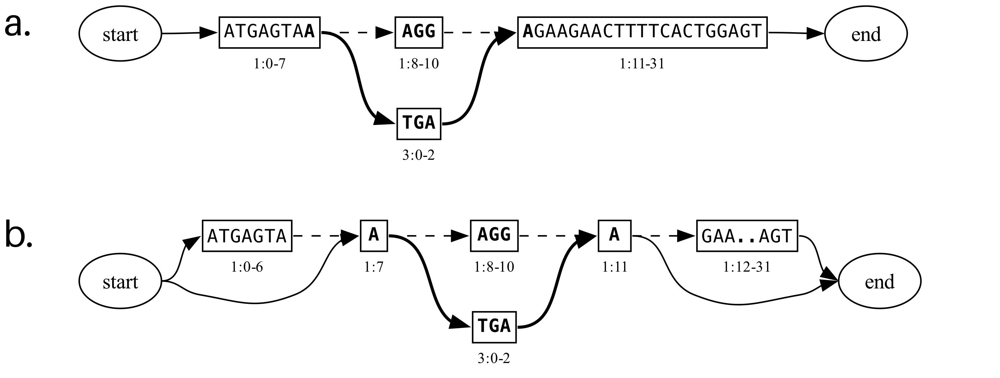
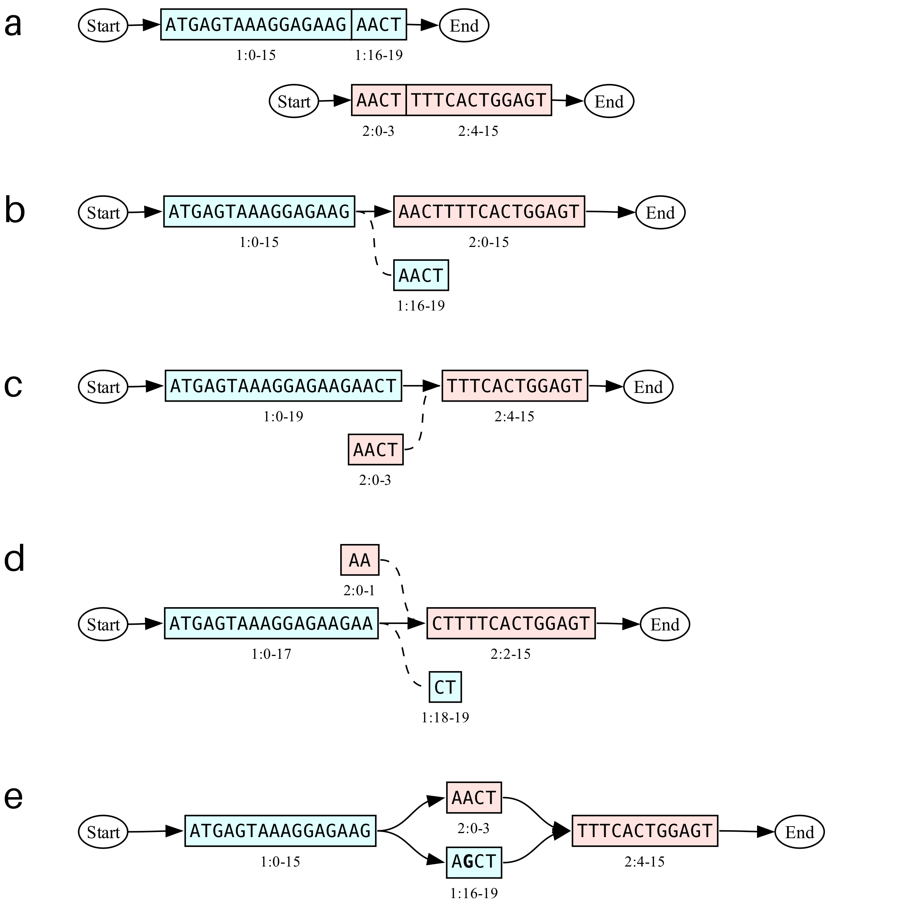
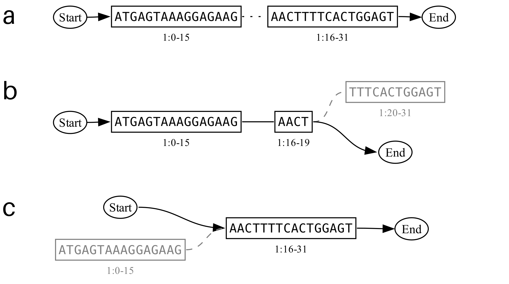
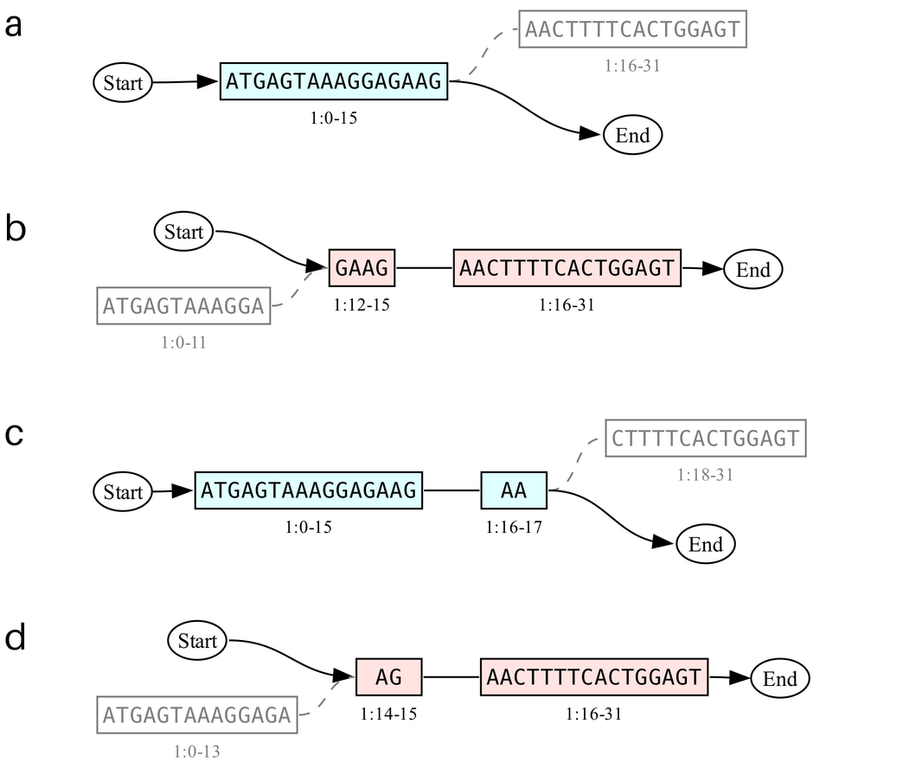

# Graph Operators

_Build_ and _derive_ operations work purely with graphs - they take graphs as input and produce new graphs as output, unlike update operations which incorporate external data. The fundamental difference between build and derive lies in how they handle sequence relationships: build operations create new independent graphs by joining, replacing, or dividing sequences, while derive operations maintain a shared reference backbone across all input and output graphs, preserving the context of variants within the original sequence framework. This is not a hard rule, and it is possible to use derive operations to design
cloning experiments for new constructs and vice versa.

## Derive
### Detach

Pangenome graphs can get rather big and unwieldy, but using the detach operation we can extract a specific region to work on, and later on merge back into the complete sequence. The first panel in the figure below represents a sequence in which an insertion, substitution, and deletion has taken place. We want to extract just the region indicated in bold, which is defined by two linear coordinates on a path, or a gen accession.

In this case we have a sample S1, which contains a sequence graph with the name 'chr1'. Our region can be accessed through the reference path of chr1, so we don't have to specify a path-name. More precisely: `--region chr1:5-12` refers to positions 5 to 12 on the designated reference path of the graph with the name chr1. If we wanted to use a different path on chr1, we would also use the `--path-name` argument (in addition to the sample and region). Lastly, we add `--new-sample S2` because we want to create a new sample S2 instead of modifying sample S1. 

```console
gen derive --detach --sample S1 --region chr1:5-12 --new-sample S2
```

Upon receiving this command, gen creates a new graph in which the start and end pointers have been moved, and only the nodes and edges
reachable between the new start and end points are retained. If no sample name is provided for the new samples, gen will edit the original sample instead.  When exported, these files are much smaller since they do not include edges and nodes that are no longer relevant. But as long as the bases (or residues) at the very ends stay intact, they can be easily imported and re-attached to a larger backbone graph as shown in Figure 1.


### Attach
Detached graphs can be (re)attached to any graph that shares the same backbone. The attach operation 

```console
gen derive --attach --sample S2 --backbone S1 --new-sample S3
```


<figure style="width:800px">

<figcaption width=800><em>Figure 1</em>: a) DNA sequence graph representing the insertion of the trinucleotide CCC, and a substitution of AGG by TGA; the section we wish to detach is indicated in bold. Numbers below the blocks indicate the gen node id and corresponding coordinate range. b) Subgraph that was detached, note the single-nucleotide terminal blocks A and A. c) Sequence graph with the same node 1 backbone; the terminal blocks from panel b are highlighted in bold. d) Result of attaching the subgraph from panel b to the graph in panel c.</figcaption>
</figure>


### Union
A graph merge operation is performed by taking the union of their edges, and any resulting new blocks are calculated on the fly. This is useful to combine distinct sequencing datasets or engineered libraries in a single object that can be more easily handeled and tracked. 


<figure style="width:800px">

<figcaption width=800><em>Figure x</em>:</figcaption>
</figure>


<figure style="width:800px">

<figcaption width=800><em>Figure x</em>:</figcaption>
</figure>

**_Figure 3_**: _..._


### Intersect
The complementary operation to a union, is to retain only the edges that are present in both, i.e. the intersection. 

### Difference

## Build

### Stitch
`gen build --stitch --samples S1,S2,... --new-sample Sx --overlap 20`

<figure style="width:800px">

<figcaption width=800><em>Figure x</em>:</figcaption>
</figure>


### Split
`gen build --split --sample S1 --name X --position 1,2,3,... --overlap 20 --new-sample S2`


<figure style="width:800px">

<figcaption width=800><em>Figure x</em>:</figcaption>
</figure>

<figure style="width:800px">

<figcaption width=800><em>Figure x</em>:</figcaption>
</figure>


### Splice

### Circularize