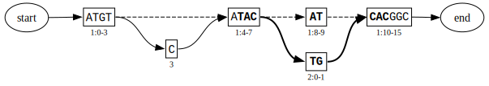
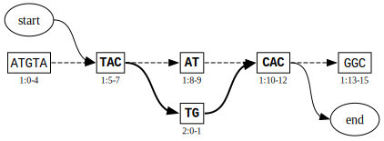

# Graph Operators

## Extract

The graph below represents a sequence in which an insertion and a substitution has taken place. We want to extract the region highlighted in bold, in such a way that we can later on merge it back into the sequence we started out with.

**_Figure 1_**: _..._

We do this by creating a new graph in which the start and end pointers have been moved, and only the nodes and edges
reachable between the new start and end points are retained. In this case that means that the edges to node 3 are clipped,
as well as any implicit internal edges that are no longer relevant. This results in the graph below:

**_Figure 2_**: _Extraction from Figure 1_

## Merge

A graph merge operation is performed by taking the union of their edges, and any resulting new blocks are calculated on the fly.
Let's start out with the graph shown in Figure 3, and merge it with graph shown in Figure 2.

**_Figure 3_**: _..._

This results in the figure shown below. You can see that the node with ID 1 has been split into new blocks to accomodate
the merged graph, but not introduce more internal edges than necessary.

**_Figure 4_**: _Merge Figure 3 into Figure 2_

## Intersection

The complementary operation to a union, is to retain only the edges that are present in both, i.e. the intersection. 

**_Figure 5_**: _..._

**_Figure 6_**: _Intersection of the graphs shown in Figure 5_