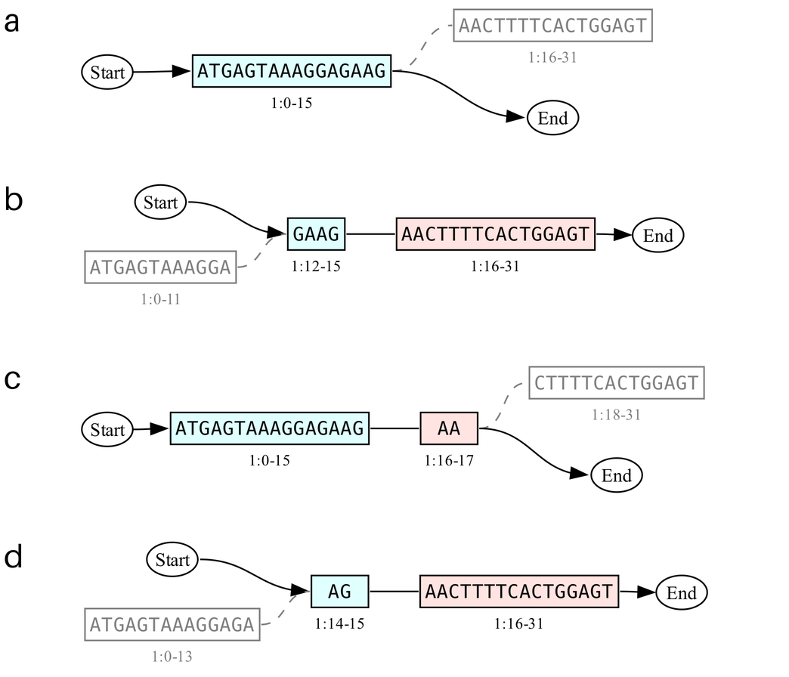

# Graph Operators

In addition to _update_ commands that incorporate variants from external data, gen also provides a set of operations for
graph manipulation within the client. The operations are organized into two categories: _derive_ commands and _make_
commands. The _derive_ command family computes subgraphs and combinations through various analytical operations. The
following subcommands are available:

- `derive subgraph`: extracts a region or subset based on specific criteria
- `derive chunks`: partitions a graph into multiple (overlapping) subgraphs
- `derive union`: combines variants from multiple inputs as a single graph
- `derive intersection`: selects variants common to all inputs
- `derive difference`: computes the set difference between two graphs

These operations help a user design cloning workflows and navigate long sequences with many variants. An example
workflow could start with the grouping of isolates based on phenotypical measurements, followed by selection of the
mutations that are shared within, but not between, groups for further study. The resulting graphs are made up out of
combinations of existing variants, derivation does not introduce new variants. This is not the case for the _make_
command family, which implement operations that do modify the underlying topology:

- `make stitch`: performs linear composition by joining the terminal _end_ node of one graph to the initial _start_ node
  of another graph.
- `make splice`: embeds one graph into another by excising and replacing a subgraph.
- `make delete`: removes a region while maintaining graph connectivity.
- `make insert`: embeds a nested graph at a specified position.

Recall that a graph is identified on three facets: name, sample, and collection. Each of these are strings: the name
refers to the underlying biological identity of the graph (for example "chromosome I"); the sample identifies a specific
variation or instance of the graph; and collections group a set of graphs together. Practically this means that
"chromosome I in sample S1" is a different object than "chromosome I in sample S2", and one graph can be changed without
forcing the edit to propagate to the other. But because both graphs share the same universe of node and edge
identifiers, variants and annotations can still be easily propagated between samples if desired. 

Each sample can be associated with multiple graphs (e.g. all chromosomes in a genome), as long as their names are unique
in the repository. Beyond that, gen imposes few restictions, which simplifies integration with ELN and LIMS interfaces.
The sample identifier can refer to sequencing data from a physical specimen or individual, for example. But it can also
refer to an entire experiment or population, or even be a purely virtual object representing a specific instance or
variation of a graph. Not every graph has to be associated with a sample, and if it is not, that graph is said to be
part of the _null sample_. 

The name facet determines which operations are possible between graphs. Set operations like union or intersection only
operate between graphs sharing the same name, hence the primary input to these commands are samples. For example, taking
the union of two samples results in a new sample with the same number of graphs, each combining the sample-specific
variations of their named counterpart. _Make_ commands tend to require the user specify both the name and sample as
input (except for graphs in the _null_ sample). The user can then choose to save the output under a new name and/or in a
new sample.

A graph's name and sample identifier can be almost any text string as long as it is unique within the context of the
current collection in the repository. Placeholder symbols like `%n` and `%u` provide an easy way to avoid naming
conflicts. When `%n` is used in a pattern, it is automatically replaced by the *n*ext available numerical identifier for
that pattern, so if "plasmid\_1" and "plasmid\_2" already exist,`--new-name "plasmid\_%n"` results in a new graph called
"plasmid\_3". Any characters that come behind `%n` and a non-numerical character are not taken into account, so
"plasmid\_2\_abc" will still be followed by "plasmid\_3". This allows users to give more information without restarting
the count, for example "plasmid\_%n\_expression-library". On the first use within a collection `%n` starts at 1,
afterwards it will always be larger than the previous occurence of the pattern (gaps in the range are not filled). This
avoids name collisions within a branch, but may still lead to conflicts when one branch is merged into another,
requiring a name change at that point. This is not a problem for the `%u` placeholder, which is automatically replaced
by the first 7 characters of the text representation of a Universally *u*nique identifier (UUID), a large random number
that is statistically unlikely to ever come up twice. Using only the first 7 characters is a compromise between
legibility and uniqueness, and should be sufficient in most cases. For very large repositories the odds of a collision
increase however, and a `%U` placeholder (capitalized) can be used to include a full 128-bit UUID instead.

While there is a certain directionality to the intent of _derive_ and _make_ operations (respectively, analysis and
design of experiments), users should feel empowered to combine operations as needed. For example, deriving a subgraph
from a large pangenome graph can make a design task more manageable by hiding overlapping or irrelevant variants. The
original sequence context can be restored afterwards by performing a splice operation at the same location.

## Example workflow: pooled cloning
Pooled (a.k.a. multiplex, one-pot) experiments can be a very cost-effective way to generate a large amount of data.
Instead of building or testing each variant in a separate liquid sample throughout the experiment, pooled workflows
combine many variants per sample at various stages in the workflow. In the domain of DNA cloning this is particularly
attractive for combinatorial sequence assembly: combining 10 variants of part A, with 10 variants of part B results in a
total diversity of 100 unique sequences, but requires synthesis of only 20 fragments. For larger and more complex design
this advantage becomes even greater. The resulting library can then be turned into isolates for an arrayed screening
assay, or handled as pool in a multiplex assay like cell sorting. These assays generally involve coupling a desired
phenotype to a signal that can be read out at the single cell level (for example fluoresence), and then sorting cells
into bins based on that signal. These bins can then be further analyzed with Next Generation Sequencing (NGS) methods to
determine which variants are enriched in one population over another.

Despite the advantages to scale and cost, pooled workflows are not yet widely adopted in the field. One of the main
barriers to entry is a, real or perceived, lack of software support: genetic design tools and sequence management
systems are built around an assumption that each digital sequence maps to an isolated sample and its replicates. Or vice
versa, that each experimental sample maps to one expected digital sequence. This user interface has worked well for
smaller experiments, but it does not scale to high throughput experiments unless the user has the computational
expertise to automate design and analysis tasks. The Gen data model does not make such assumptions, and by treating a
sample as a graph of possible sequences, Gen lends itself well to the design and analysis of pooled experiments. An
example pooled Type IIs restriction/ligation workflow, commonly known as Golden Gate cloning, is described below:

### 1. Import library
- Currently this is an "update" command that creates a combinatorial library based on a set of sequences (fasta) and a
library layout (csv). By making this an "import" users can create a library from scratch, and not as an edit to an
existing sequence.
- At this point the user is mainly thinking about the final design they want to test, not how they will be cloning it.
It could be helpful to (in the future) provide an `--affix` option to merge common prefixes and suffixes to make good
cloning sites more obvious. Many genetic parts naturally start or end the same way, which should be represented in the
graph structure. For example, a combination of ribosome binding sites that all end in A, with coding sequences that
start with ATG.
```
Effect of --affix option when generating combinatorial libraries, demonstrated through a CSV table representation where columns denote genetic parts and rows variants.

   Before:                         After:
   ...AGGAGGA, ATGAAA...           ...AGGAGG, AATG, AAA...
   ...AGGTGTA, ATGTGT...           ...AGGTGT,     , TGT...
   ...AGGCGGA, ATGCTA...           ...AGGCGG,     , CTA...
   ...       , ATGGGC...           ...      ,     , GGC...
```
(Implementation note: this happens at the node level, sequences don't have to be literally trimmed. The suffix/prefix
may be a separate sequence & node to avoid any issues with library edits down the line, for example if the first
sequence is dropped. See fixtures/affix_* for an example fasta and csv file.)


### 2. Make paths
- Exposes the internal make-all-paths functionality to the user, with a flag to limit the number of paths generated.
Limiting the number of paths avoids a combinatorial explosion when a design has many variable parts. The last path
becomes the "current path", which can then be exported to serve as a linear reference frame for later operations.
- In this case the flag `-n 1` would mean: "get the first path from start to end, and make that the current path"
- The %u and %n placeholders described above are used to ensure unique path names.

### 3. Export fasta (or genbank)
- Exports the current path to a format that users can work with in the environment they are used to.
- Highlighting the blocks that act as "articulation points" (a.k.a. "cut vertices") would be very helpful to select good
junction sites for the assembly. Ideally as annotations, or by showing only those subsequences in upper case. 

### 4. Derive chunks
- See further in this document for description. The current path is used as the linear reference by which the user
specifies the breakpoints. You can think of this as designing the assembly workflow in reverse.

### 5. Make stitch
- Virtual ligation operation to attach adapters containing a TypeIIS restriction site, appropriate spacers, and possibly
priming sites for PCR. 
- These sequences will be ordered as linear DNA, or alternatively as plasmid DNA by stitching to a vector instead of
adapters.

### 6. Make paths
- Generate all possible paths for the chunks with adapters. If the breakpoints in step 4 were chosen correctly, path
counts should be manageable since there is no combinatorial explosion for individual chunks. 

### 7. Export fasta
- Saves linear sequences to send to synthesis provider.

### 8. Export GFA
- Saves the graph of the assembled DNA for visualization and read mapping by graph aware sequence alignment tools.

The design workflow may end here, but many users like to simulate the cloning process as a sanity check before pulling
the trigger on their synthesis order. In our case that would be the reverse set of operations:

### Derive subgraph
- Extracts the subgraph between the adapters

### Make stitch
- Overlap-aware ligation of the generated subgraphs
- Raises an error if overlaps are not correct

### Make paths
- Generate an example sequence to crossreference to the design.


## Derive commands

### Subgraph [WIP]
Pangenome graphs can get rather big and unwieldy, but by deriving a subgraph we can extract a specific region to work on
in a sequence editor, and later on merge it back into the complete sequence. Because a subgraph does not include edges
and nodes that are no longer relevant to the user, it can be exported to a file that is much smaller in size and is
generally easier to visualize or edit. To illustrate, the first panel in Figure X represents a sequence in which an
insertion and substitution have taken place. We want to take a closer look at the region indicated in bold, and use the
`derive subgraph` command as follows:

```console
gen derive subgraph —-sample S1 —-region chr1:7-12 —-new-sample my_locus
```

The region string can be read as “the sequence from position 7 through 12 (but not including 12) on the current path of
the graph with the name chr1”. An error will be raised if the graph does not have a designated path. If we wanted to use
a different path on chr1, we would also specify the name of that path as `—-backbone` argument along with the region. It
must be noted that even though the region definition is linear, the derived subgraph is not. Instead, the ends of the
region induce a subgraph consisting of all the blocks and edges that can be accessed by walks between both points. Any
edges to or from blocks that are outside of the subgraph will be rewritten to edges to the end and start dummy nodes,
respectively.

Alternatively, users can specify the boundaries directly by entering a pair of block coordinates as the `—-start` and
`—-end` options. Block coordinates follow the format `m.n`, where m and n refer to the node ID in the graph, and the
position on that node, respectively. This ensures consistency between multiple versions of the graph, since node IDs do
not change as the graph grows. This is very similar to the format used by block identifiers that can be found in
visualizations or exported GFA files, where they take the role of segment names. In a visualization a block may be
labeled as 2:10-20 in the visualization, indicating that it refers to positions 10 through 20 on node 2. In the GFA file
the corresponding identifier would be 2.10, the second coordinate can be derived from the length of the segment.
Therefore, to indicate a block coordinate at position 5 on a block labeled 2:10-20 in a visualization, a user would
enter 2.15.

Lastly, users can define a subgraph through a named accession instead. An accession also defines a part of the graph
through coordinates on a linear path, but they are stored by name in the gen database. and referenced through the
`-—accession` option of the extract command. The accession does not have to be defined in the sample from which you
derive a subgraph, it is automatically translated from the coordinate frame of the sample in which it was originally
defined. This is only possible if the graphs are related trough the sample lineage, and an error will be raised if they
are not.

The `--sample` option specifies which sample to take a subgraph from, if it is not specified graphs from the _null
sample_. In the example above we also use the `—-new-sample` option to create a new sample called 'my_locus' for the
output, otherwise gen will store it in the null sample. While we could always roll back to the previous contents, it can
still be useful to create a new sample and keep the original sample as a reference scaffold. As long as the bases (or
residues) at the very ends of the subgraph remain intact, edited subgraphs can be easily imported and re-attached to a
larger scaffold graph using the `derive supergraph` command.

By default, subgraphs retain the name of their parent graph: the graph contained in the 'my_locus' sample created by the
example command above is still called 'chr1', since it can be seen as a window into the 'chr1' sequence. If you want to
include the extracted subgraph as part of a synthetic design, however, it can be useful to save the subgraph itself
under a new name using `--new-name`. This complicates the use of other 'derive' operations later on, but makes it
possible to use a subgraph in 'make' operations.

<figure style="margin-left: auto; margin-right: auto">

<figcaption width=800><b>Figure X</b>: a) DNA graph representing the insertion of the trinucleotide CCC, and a 
substitution of AGG by TGA; the section we wish to extract as subgraph is indicated in bold. Numbers below the blocks 
indicate the gen node id and corresponding coordinate range. b) Extracted subset, note terminal blocks with nucleotides 
A and A. c) Graph in the same lineage as the original graph, with the terminal blocks from panel b highlighted in bold. d) Supergraph created by splicing the 
subgraph in panel b into the scaffold in panel c. </figcaption>
</figure>

### Chunks
```console
Usage: gen derive chunks INPUT (--breakpoints POS1 [POS2 ...] | --chunksize LENGTH) [--backbone PATH] [--sample INPUT_SAMPLE]
[--overlap FWD[:BWD] [FWD[:BWD]] ...]

Split a graph at the given breakpoints or into chunks of a specific size.

INPUT: name of the graph to derive chunks from

Options:
--breakpoints POS1 [POS2 ...]
Split the graph at specific positions on a reference path.
--chunksize LENGTH Place breakpoints at regularly spaced intervals. Mutually exclusive with --breakpoints.
--backbone PATH Interpret or compute breakpoints in the context of a path other than the default reference path.
--sample INPUT_SAMPLE Input graph is associated to a specific sample.
--overlap FWD[:BWD] [FWD[:BWD]] ...
Make chunks overlap by n bp added to the left chunk at each break point, and m bp on the right chunk.
--new-name OUT1 [OUT2 ...]
Output chunk name(s) with support for placeholders `%n` (next) and `%u`/`%U` (unique). If only
OUT1 is provided, it will be reused with new placeholders for each chunk.
Default: "<INPUT>.%n"
--new-sample OUTPUT_SAMPLE Associate the output chunks to a new sample, or the null sample if not specified.
--force Allow variable regions at breakpoints and in overlaps. Warning: edges that span chunk boundaries
will be dropped.
```

A graph can be split into pieces to enable a synthesis or cloning campaign using the `derive chunks` subcommand, which
can be used, for example, as follows:

`gen derive chunks chr1 --breakpoints 100 200 300 —-overlap 20`

This command can be interpreted as "split the graph called chr1 into chunks by introducing breakpoints at positions 100,
200 and 300, using the designated linear path associated with ch1 as the coordinate reference frame and including a 20
bp overhang".

The positions at which the graph should be split can either be given explicitly (`--breakpoints`), or they can be
calculated automatically (`--chunksize`). In both cases, positions are interpreted as linear coordinates on the
reference path of the graph. The `--backbone` option can be used to select a specific path instead, and the `--sample`
option is used to select an instance of the graph associated with a specific sample.

Chunks can optionally be made to overlap by having adjacent chunks start or end at a position that is offset from each
breakpoint. This is illustrated in Figure 1, in which the right chunk starts exactly at the breakpoint, while the left
chunk ends 4 base pairs downstream. This is referred to as a 'forward' overlap, and is the default structure if the
argument consists of a single integer (e.g. `--overlap 4`). To obtain the overlap structures demonstrated in Figure 2,
users can specify how much of an overlap to attach to the chunk to the right of the breakpoint by entering a pair of
integers separated by a colon. A 'backward' overlap is specified as `--overlap 0:4`, for instance, and an overlap that
is distributed to both sides as `--overlap 2:2`.

The same overlap is applied at each breakpoint if only one length (pair) is provided. Multiple overlap arguments can be
given to specify the overlap at each breakpoint individually. In that case the number of overlap arguments must be equal
to the number of breakpoints. This can be used to create outwardly extended overlaps from a center chunk for example:
`--breakpoints 100 200 --overlaps 0:4 4:0`

Giving users a choice in overlap design allows them to model their specific cloning protocol as they see fit. It also
helps prevent overlaps from running into a variable region, which normally causes an error. The `--force` flag overrides
this check, but it is important to note that any variable region that spans chunk boundaries will be dropped. Or in
terms of the graph: the breakpoints (shifted to account for overlap) induce a subgraph that contains only the edges and
blocks that can be reached on walks between the (shifted) breakpoints.

By default, chunks are named after their parent (chr1 becomes chr1.1, chr1.2, chr1.3) and stored in the null sample, but
users can also specify graph and sample names as a list and/or with wildcards (`--new-names`). 


<figure style="margin-left: auto; margin-right: auto">

<figcaption width=800><b>Figure 1</b>: <kbd> gen make chunks chr1 --breakpoints 15 --overlap 4</kbd><br>
 (a) Chr1 graph with desired breakpoint indicated as dotted line.
 (b) A left chunk with a forward overlap of 4 nucleotides is created by moving the End node of the graph. Block 1:20-31 is shown to indicate the change (dashed line = reference), it cannot be accessed on any path between start and end.
 (c) Right chunk without overlap compared to the breakpoint. For this chunk the edge from the start node is moved instead.

</figcaption>

</figure>

<figure style="margin-left: auto; margin-right: auto">

<figcaption width=800><b>Figure 2</b>:
(a,b) <kbd> gen make chunks chr1 --breakpoints 15 --overlap 0:4</kbd><br>
Left and right chunk made from the graph in Fig 1a, but with a backwards overlap.
(c,d) <kbd> gen make chunks chr1 --breakpoints 15 --overlap 2:2</kbd><br>
Left and right chunk with a forward and backward overlap of 2 nucleotides, or 4 in total.
</figcaption>
</figure>

### Union [WIP]
```console
Usage: gen derive union S1 S2 [S3 ...] [--new-sample OUTPUT]
            
        Combines the contents of two or more samples, merging graphs based on their name and printing statistics to the screen.

Options:
    --new-sample OUTPUT Store output as a new sample. Supports placeholders. 
```

The `derive union` command combines variants across samples by deriving the union of the graphs they contain. This is
used to merge experimental results or library designs into samples that can be handled and tracked as a unit. Graph
unions also allow researchers to model biological processes like a cross between two individuals. The combined graph
represents all possible allele combinations, and can be used to align sequencing reads for instance.

graphs with a common name across the input samples are merged by combining their nodes and edges. For example, if both
samples contain just 'chr1', the output sample will comprise a single graph that represents all variants of 'chr1'. If
the input samples contain graphs with different names, the output sample will contain multiple graphs. For example, the
union of sample 'S1' which contains 'chr1', with 'S2' containing 'chr2' results in a sample that contains both 'chr1'
and 'chr2'.

### Intersection [WIP]
The complementary operation to a union, is to retain only the edges that are present in both, i.e. the intersection.
This requires special handling of boundary edges that represent the wildtype in a heterozygous genome, because these are
implied rather than made directly. 

<figure style="margin-left: auto; margin-right: auto">

<figcaption width=800><b>Figure x</b>:</figcaption>
</figure>

```console
Usage: gen derive intersection S1 S2 [S3 ...] [--new-sample OUTPUT]
            
        ...

Options:
    --new-sample OUTPUT Store output as a new sample. Supports placeholders. 

```

### Difference [WIP]

<figure style="margin-left: auto; margin-right: auto">

<figcaption><b>Figure x</b>a) First event (insertion). b) Second event c) Second event in alternative sample d) Difference between C and B results in detached blocks. d) The scaffold prevents blocks from getting detached.</figcaption>
</figure>

```console
Usage: gen derive intersection S1 S2 [S3 ...] [--new-sample OUTPUT]
            
        ...

Options:
    --new-sample OUTPUT Store output as a new sample. Supports placeholders. 
    --scaffold 
```

## Make

### Stitch [WIP]
```console
Usage: gen make stitch INPUT1 INPUT2 [INPUT3 ...] [--sample INPUT_SAMPLE] [--overlap FWD[:BWD] [FWD[:BWD]] ...] [--force] [--new-name OUTPUT] [--new-sample OUTPUT_SAMPLE]

Stitch two or more graphs together. The input graphs must come from the same sample (or the null sample).

INPUT1, INPUT2, ...: names of the graphs to combine, in the order they should be stitched together.

Options:
--sample INPUT_SAMPLE Take input graphs from a specific sample.
--overlap FWD[:BWD] [FWD[:BWD]] ...
Resolve overlaps during stitching. FWD is the number of base pairs to trim from the end of the graph to the left of the junction, and BWD is the number of base pairs to trim from the start of the graph to the right of the junction. A sequence mismatch in the overlap region will raise an error unless --force is used.
--force Allow mismatches between overlapping sequences. If a mismatch is found, both overlap sequences will be included in the output graph.
--new-name OUT1
Name of the output graph, with support for placeholders `%n` (next) and `%u`/`%U` (unique).
Default: "INPUT1,INPUT2,..."
--new-sample SAMPLE Associate the output graph to a new sample, or the null sample if not specified.
```

The stitch operation provides a general-purpose representation of molecular cloning workflows in a graph sequence model.
Supporting specific protocols like Gibson assembly is considered out of scope for the gen client, but users are
encouraged to leverage gen for the underlying primitives. 


<figure  width=800 >

<figcaption><b>Figure X</b>: a) Two graphs to be stitched together, with an overlap of 4 base pairs. b) Stitch with --overlap of 4 or 4:0, retaining the overlap on the right graph. c) Stitch with --overlap 0:4, retaining the overlap on the left graph. d) Stitch with --overlap 2:2, trimming from both sides of the junction. e) Resolution of an overlap mismatch with --force; both overlap sequences are included in the output graph. The overlap parameters 4, 4:0, 0:4, and 2:2 are all equivalent in this case.</figcaption>
</figure>


### Splice [WIP]
Whereas `stitch` operations take place at the ends of a graph, `splice` works on the _inside_ of a graph. It can be used
to model a substitution genome edit, but also to reintegrate an extracted subgraph.

TODO

### Delete [WIP]
TODO

### Insert [WIP]
TODO


### Circle [TBD]
TBD


