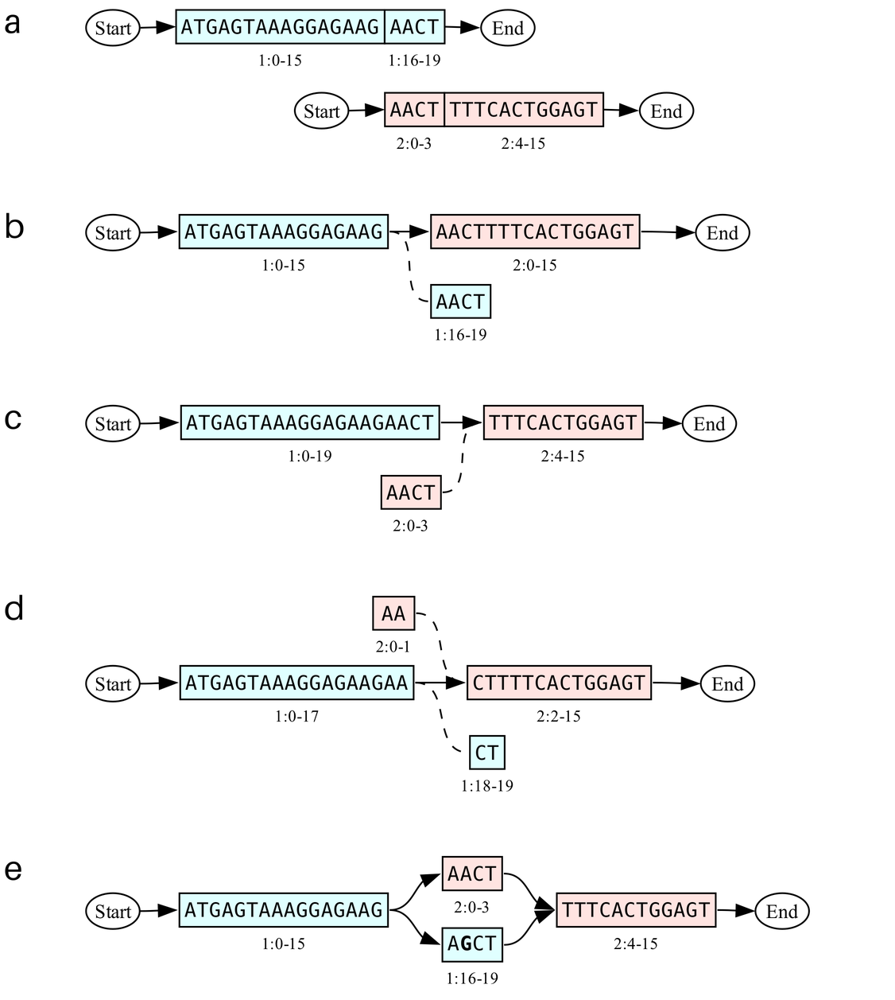
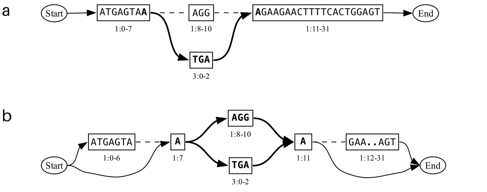

# Graph Operators

_Make_ and _derive_ operations work purely with graphs - they take graphs from the database as input and produce new
graphs as output, unlike update operations, which incorporate external data. The fundamental difference between _make_
and _derive_ lies in how they handle sequence relationships across their inputs and outputs: _make_ operations create
new connections between disjoint input graphs, whereas _derive_ operations take place within a common reference
backbone. For example, deriving the intersection of evolved sequence variants of a protein within an experimental group
is an operation where all inputs and outputs are versions of that same protein. In contrast, inserting a transgene into
an expression vector requires two distinct inputs (the vector and the gene). This is not intended to be a strict rule,
and there are examples where the line blurs: for example, splitting a computationally designed chromosome into chunks
for synthesis, and then stitching them together is a workflow that arguably takes place entirely within the sequence
context of the chromosome, yet those are still considered to be _make_ operations. Likewise, while there is a certain
directionality to the intent of _derive_ and _make_ operations (respectively, analysis and design of experiments), users
should feel empowered to combine operations as needed.

Most _make_ commands primarily address sequence graphs by their name, for example, "chr1" for chromosome I. With gen
being a version control system, it is safe to overwrite sequences when edits (real or virtual) are made, you can always
roll back the repository to a previous version. The sequence graph model also makes it possible you to store entire
libraries of edit variants in the same chr1 object.

That being said, creating an expression construct by combining a set of regulatory parts and a coding sequence is an
operation where choosing a name for the output makes sense. Commands like `stitch` and `splice` have a `--new-name`
argument that can be almost any text string as long as it is unique within the context of the current collection in the
repository. Including placeholder symbols like `%n` and `%u` in the name is an easy way to avoid naming conflicts. `%n`
is automatically replaced by the *n*ext available numerical identifier for that name, so if plasmid_1 and plasmid_2 already exist,`--new-name "plasmid_%n"` results in a new graph called "plasmid_3". For each new naming pattern the count starts at 1, and the most next index will always be larger than the previous one (gaps in the range are not filled). This avoids name collisions within a branch, but may still lead
to conflicts when one branch is merged into another, requiring a name change at that point. This is not a problem for
the `%u` placeholder, which is automatically replaced by a Universally *u*nique identifier (UUID), a combination of
alphanumerical characters that is statistically unlikely to ever come up twice. As a compromise between legibility and
uniqueness, only the first 7 characters are actually used. For very large repositories the odds of a collision increase however, and a
`%U` placeholder (capitalized) can be used to include a full 128-bit UUID instead.

A second facet by which sequence graphs can be addressed is the _sample_ they are associated with. In the gen data
model, a sample is a text string corresponding with a physical object or individual, for example. But it can also refer
to an entire experiment or population, or even be a purely virtual object representing a specific instance or variation
of a sequence graph. Practically this means that "chr1 in sample S1" is a different object than "chr1 in sample S2", and
changes to one do not automatically propagate to the other. A sequence graph can be associated with at most one sample,
but one sample can hold multiple sequence graphs (e.g. all the chromosomes that make up a genome). Not every sequence
graph has to be explicitly associated with a sample, and those that are referred to by name only are said to be part of
the _null_ sample. 

Ultimately, samples allow users to represent _observed_ sequence variants next to _intended_ variants, model molecular
cloning workflows, and design experiments. They are the primary input and output of `derive` operations, but are also
used in `make` commands to refer to a specific instance of a named sequence graph. Just like the `--new-name` argument
described above, `--new-sample` supports the placeholders `%n` (next) and `%u`/`%U` (unique).

## Make

### Chunks
A sequence graph can be split into pieces to enable a synthesis or cloning campaign using the `make chunks` subcommand,
which can be used, for example, as follows:

`gen make chunks chr1 --breakpoints 100 200 300 —-overlap 20`

This command can be interpreted as "split the sequence graph called chr1 into chunks by introducing breakpoints at
positions 100, 200 and 300, using the designated linear path associated with ch1 as the coordinate reference frame and
including a 20 bp overhang". 

The positions at which the graph should be split can either be given explicitly using the `--breakpoints` option, or they 
can be calculated automatically using the `--chunksize` option. These positions are interpreted or calculated as linear coordinates 
on the reference path of the graph. The `--backbone` option can be used to select a specific path instead, and the `--sample` 
option is used to select an instance of the graph associated with a specific sample.

With the `--overlap` option, chunks can be made to overlap at the breakpoints. An overlap occurs when adjacent chunks
start or end at a position that is offset from the given breakpoint. This is illustrated in Figure 1, in which the right
chunk starts exactly at the breakpoint, while the left chunk ends 4 base pairs downstream. This is referred to as a
'forward' overlap, and is the default structure if the argument consists of a single integer (e.g. `--overlap 4`). To
obtain the overlap structures demonstrated in Figure 2, users can specify how much of an overlap to attach to the chunk
to the right of the breakpoint by entering a pair of integers separated by a colon. A 'backward' overlap is specified as
`--overlap 0:4`, for instance, and an overlap that is distributed to both sides as `--overlap 2:2`.

The same overlap is applied at each breakpoint if only one length (pair) is provided. Multiple overlap arguments can be
given to specify the overlap at each breakpoint individually. In that case the number of overlap arguments must be equal
to the number of breakpoints. This can be used to create outwardly extended overlaps from a center chunk for example:
`--breakpoints 100 200 --overlaps 0:4 4:0` 

Giving users a choice in overlap design allows them to model their specific cloning protocol as they see fit. It also
helps prevent overlaps from running into a variable region, which normally causes an error. The `--force` flag overrides
this check, but it is important to note that any variable region that spans chunk boundaries will be dropped. Or in
terms of the graph: the breakpoints (shifted to account for overlap) induce a subgraph that contains only the edges and
blocks that can be reached on walks between the (shifted) breakpoints.


```console
Usage: gen make chunks <NAME> (--breakpoints POS ... | --chunksize LENGTH) [--overlap FWD:[BWD] [FWD:[BWD]] ...] [--sample SAMPLE] [--backbone PATH] 
        Divide a sequence graph into multiple parts at specified positions, with or without overlap,
        resulting in distinct output objects. 


Options:
    --breakpoints POSITION ... 
    --chunksize LENGTH               
    --backbone PATH      Interpret breakpoint positions in the reference frame of the given path  
    --sample SAMPLE     Sample that contains the sequence graph to be split
    --overlap FWD:[BWD] [FWD:[BWD]] ...      
            Make chunks overlap by n bp added to the left chunk at each break point, and m bp on the right chunk. 
    --new-name NAME      
    --new-sample SAMPLE
    --force                Allow splitting at breakpoints in variable region
```


<figure style="margin-left: auto; margin-right: auto">

<figcaption width=800><b>Figure 1</b>: <kbd> gen make chunks chr1 --breakpoints 15 --overlap 4</kbd><br>
 (a) Chr1 sequence graph with desired breakpoint indicated as dotted line.
 (b) Left chunk
 (c) Right chunk
</figcaption>

</figure>

<figure style="margin-left: auto; margin-right: auto">

<figcaption width=800><b>Figure 2</b>:
(a,b) <kbd> gen make chunks chr1 --breakpoints 15 --overlap 0:4</kbd><br>
(c,d) <kbd> gen make chunks chr1 --breakpoints 15 --overlap 2:2</kbd><br>
</figcaption>
</figure>

### Stitch
The stitch operation provides a general-purpose representation of molecular cloning workflows in a graph sequence model.
Supporting specific protocols like Gibson assembly is considered out of scope for the gen client, but users are
encouraged to leverage gen for the underlying primitives. 

TODO

<figure  width=800 >

<figcaption><b>Figure X</b>:</figcaption>
</figure>


### Splice
Whereas a the previous operation joins the ends of multiple sequence graphs, `splice` inserts one graph _into_ another
graph.

TODO

### Delete/Insert/Replace 
TBD (could be used as shorthand for splices)

### Circularize
TBD

## Derive

### Union
The `derive union` command combines variants across samples by deriving the union of the sequence graphs they contain.
This is used to merge experimental results or library designs into samples that can be handled and tracked as a unit.
Graph unions also allow researchers to model biological processes like a cross between two individuals. The combined
sequence graph represents all possible allele combinations, and can be used to align sequencing reads for instance.

Sequence graphs with a common name across the input samples are merged by combining their nodes and edges. For example,
if both samples contain just 'chr1', the output sample will comprise a single sequence graph that represents all
variants of 'chr1'. If the input samples contain sequence graphs with different names, the output sample will contain
multiple sequence graphs. For example, the union of sample 'S1' which contains 'chr1', with 'S2' containing 'chr2'
results in a sample that contains both 'chr1' and 'chr2'.


```console
gen derive union <sample 1> <sample 2> [<sample n>] [options]
        Combines the contents of multiple samples, merging sequence graphs based on their name.
        The output replaces the null-sample sequence graphs unless the --new-sample option is used. 

        Options:
            --new-sample <sample>           Name of sample that will be created to store output 
```


### Intersection


The complementary operation to a union, is to retain only the edges that are present in both, i.e. the intersection. 

<figure style="margin-left: auto; margin-right: auto">

<figcaption width=800><b>Figure x</b>:</figcaption>
</figure>

```console
gen derive intersection <sample 1> <sample 2> [<sample n>] [options]
        Computes the intersection between multiple samples


        Options:
            --new-sample <sample>
            --scaffold <sample> 
```

### Difference

<figure style="margin-left: auto; margin-right: auto">

<figcaption><b>Figure x</b>a) First event (insertion). b) Second event c) Second event in alternative sample d) Difference between C and B results in detached blocks. d) Scaffold reattaches blocks </figcaption>
</figure>

```console
gen derive difference <sample 1> <sample 2> [<sample n>] [options]
        Computes the difference between multiple samples


        Options:
            --new-sample <sample>
            --scaffold <sample> 
```


### Subgraph
Pangenome graphs can get rather big and unwieldy, but by deriving a subgraph we can extract a specific region to work on
in a sequence editor, and later on merge it back into the complete sequence. Because a subgraph does not include edges
and nodes that are no longer relevant to the user, it can be exported to a file that is much smaller in size and is
generally easier to visualize or edit. To illustrate, the first panel in Figure X represents a sequence in which an
insertion and substitution have taken place. We want to take a closer look at the region indicated in bold, and use the
`derive subgraph` command as follows:

```console
gen derive subgraph —-sample S1 —-region chr1:7-12 —-new-sample my_locus
```

The region string can be read as “the sequence from position 7 through 12 (but not including 12) on the main linear path
of the graph with the name chr1”. An error will be raised if the sequence graph does not have a designated path. If we
wanted to use a different path on chr1, we would also specify the name of that path as `—-backbone` argument along with
the region.  It must be noted that even though the region definition is linear, the derived subgraph is not. Instead,
the ends of the region induce a subgraph consisting of all the blocks and edges that can be accessed by walks between
both points. Any edges to or from blocks that are outside of the subgraph will be rewritten to edges to the end and
start dummy nodes, respectively. 

Alternatively, users can specify the boundaries directly by entering a pair of block identifiers using the
`—-start-block` and `—-end-block` options. Block identifiers can be obtained from visualizations or exported GFA files,
where they take the role of segment names. They currently follow the format `m.n`, where m and n refer to the node ID in
the sequence graph, and starting coordinate of the block on that node, respectively. This ensures consistency between
multiple versions of the sequence graph, since node IDs do not change when new blocks are created. The end coordinate of
the block can be derived from its length, but this may be made explicit in the future if advantageous (for example
`m.n.l` where l is equal to the block length). Blocks are not stored in the database directly, but are instead inferred
from nodes and edges as needed. This also means that a block does not have to exist _a priori_ when specifying a start
or end block to create the subgraph. For example: if your graph contains a 10kb long block with ID 1.0 and you don't
want to include the entire block, then you can enter 1.5000 as start block even though there are currently no edges that
connect to that coordinate.

Lastly, users can define a subgraph through a named accession instead. An accession also defines a part of the graph
through coordinates on a linear path, but they are stored by name in the gen database. and referenced through the
`-—accession` option of the extract command. The accession does not have to be defined in the sample from which you
derive a subgraph, it is automatically translated from the coordinate frame of the sample in which it was originally
defined. This is only possible if the graphs are related trough the sample lineage, and an error will be raised if they
are not.

The `--sample` option specifies which sample to take a subgraph from, if it is not specified the graphs not associated
with a sample will be used (also known as the _null sample_). In the example above we also use the `—-new-sample` option
to create a new sample called 'my_locus' for the output, otherwise gen will store it in the null sample. While we could
always roll back to the previous contents, it can still be useful to create a new sample and keep the original sample as
a reference scaffold. As long as the bases (or residues) at the very ends of the subgraph remain intact, edited
subgraphs can be easily imported and re-attached to a larger scaffold graph using the `derive supergraph` command.

By default, subgraphs retain the name of their parent graph: the graph contained in the 'my_locus' sample created by the
example command above is still called 'chr1', since it can be seen as a window into the 'chr1' sequence. If you want to
include the extracted subgraph as part of a synthetic design, however, it can be useful to save the subgraph itself
under a new name using `--new-name`. This complicates the use of other 'derive' operations later on, but makes it
possible to use a subgraph in 'make' operations.

### Supergraph
Extracted subgraphs and their descendants can be (re)attached to the sequence graph they were derived from, or any graph
that shares at least the boundaries of the subgraph. This is done using the supergraph operation and a scaffold sample
that represents the original context. First, the boundary blocks of the input graph are used to induce an analogous
subgraph in the scaffold sample. Like in the subset operation, this subgraph consists of all blocks and edges that can
be visited between the given boundaries. Whereas the `derive subgraph` command extracts a subgraph and discards the
surrounding blocks, `derive supergraph` discards the induced subgraph and adds the surrounding blocks and edges to the
input graph. The listing below demonstrates how to use it:

``` console
gen derive supergraph —-sample my_locus —-scaffold S1 —-new-sample S2
```

This command restores the sequence context of the 'my_locus' sample using sample 'S1' as base, and saves the result as a
new sample 'S2'. The scaffold sample 'S1' remained unchanged when deriving the supergraph, and by using the
`--new-sample` option the input sample is retained as well. Note that the scaffold sample can contain more than one
sequence graph, for example to represent multiple chromosomes; all of these will end up in the supergraph output sample.

<figure style="margin-left: auto; margin-right: auto">

<figcaption width=800><b>Figure X</b>: a) DNA sequence graph representing the insertion of the trinucleotide CCC, and a 
substitution of AGG by TGA; the section we wish to extract as subgraph is indicated in bold. Numbers below the blocks 
indicate the gen node id and corresponding coordinate range. b) Extracted subset, note terminal blocks with nucleotides 
A and A. c) Scaffold graph with the terminal blocks from panel b highlighted in bold. d) Supergraph created from the 
subgraph in panel b and the scaffold in panel c.</figcaption>
</figure>

Even though the union and superset operations both provide a means to merge sequence graphs, they cannot be used
interchangeably as illustrated in Figure X

<figure style="margin-left: auto; margin-right: auto">

<figcaption width=800><b>Figure x</b>:</figcaption>
</figure>


