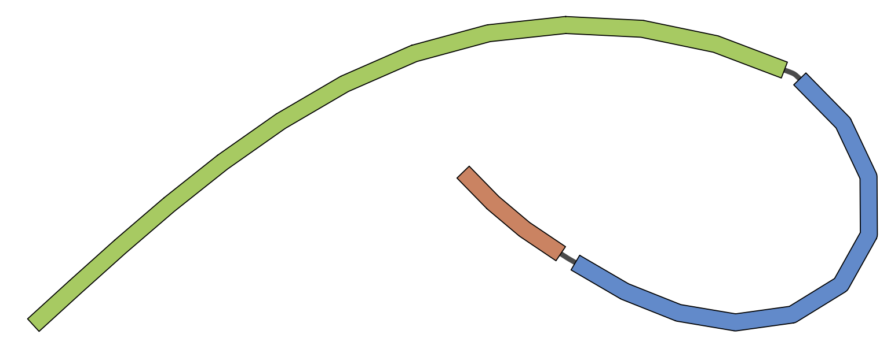

# Iterative Changes

A core capability of Gen is the ability to model iterative engineering to a cell line. This represents multiple rounds
of engineering. As an example, suppose we insert two landing pads into a genome for general use. Iterative engineering
allows us to work off the cell line assuming these changes are baked into.

The challenge in modeling iterative engineering is the frame of reference for changes. In the above example, inserting
a landing pad will change the reference coordinates of the resulting genome. Thus, if we are working with 2 landing pads,
we may want to be able to address them in either the reference frame of the initial reference genome, or in the reference
frame of the changed genome. To illustrate this, here is an example of 2 rounds of engineering from a base sequence.

First we import a sequence file

```bash
gen --db simple.db import --fasta simple.fa --name simple_example
```

This creates a collection, `simple_example` with the simple fasta file serving as the reference genome. This could just
as easily be Hg38, etc.

Next, we use a vcf file to model changes. We want to delete two regions of the genome:

```text
##fileformat=VCFv4.1
##filedate=Tue Sep  4 13:12:57 2018
##reference=simple.fa
##contig=<ID=m123,length=34>
##phasing=none
##FORMAT=<ID=GT,Number=1,Type=String,Description="Genotype">
#CHROM	POS	ID	REF	ALT	QUAL	FILTER	INFO	FORMAT	f1
m123	3	.	CGA	C	1611.92	.		GT	1
m123	16	.	GAT	G	1611.92	.		GT	1
```

```bash
gen --db simple.db update --vcf round1.vcf --name simple_example
```
This creates a new sample, `f1` with the above changes baked into its genome. This example is a haploid such as e. coli
where the genotype is always homozygous. Graphically, the genome now appears as such:



Next, we want to make more changes -- snps, insertions, and deletions based on this changed genome.

```vcf
##fileformat=VCFv4.1
##filedate=Tue Sep  4 13:12:57 2018
##reference=simple.fa
##contig=<ID=m123,length=34>
##phasing=none
##FORMAT=<ID=GT,Number=1,Type=String,Description="Genotype">
#CHROM	POS	ID	REF	ALT	QUAL	FILTER	INFO	FORMAT	f2
m123	5	.	C	G	1611.92	.		GT	1
m123	17	.	GG	GAATCAG	1611.92	.		GT	1
m123	27	.	GA	G	1611.92	.		GT	1
```

```bash
gen --db simple.db update --vcf round2.vcf --name simple_example --coordinate-frame f1
```

This command is very similar, with the exception that we are able to define which reference frame to use for changes. Here,
we specify the reference frame of sample `f1`. This operation creates a new sample, `f2`, with the reference frame of
`f1` for coordinates. If no coordinate frame is provided, the reference genome's frame of reference is used. The resulting
genome appears as follows:


## Caveats

When updating a genome based on positions, only non-ambiguous changes are permitted. For example, if the above vcf 
contained a heterozygous insertion, it would create an ambiguity in positions downstream of the insertion. Thus,
these changes are not permitted. However, this format is very amenable for simpler organisms such as e. coli.

For changes where positions are ambiguous, the following approaches may be taken to model changes:
* links here