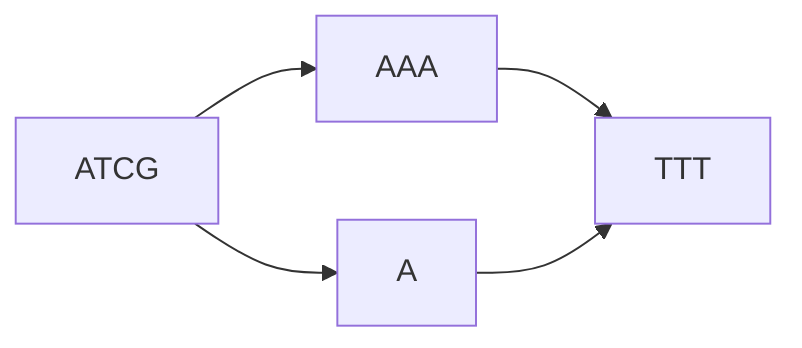
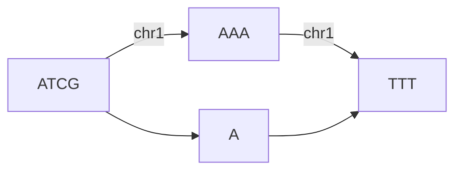
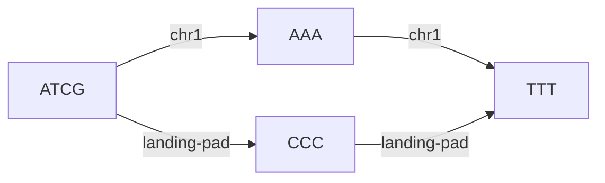
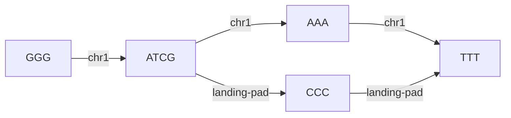

# Paths and Accessions

Graphs have particular challenges when it comes to referring to regions within one. For example, take the following
chromosome and a simple change to it:

If we specified an insertion at position 6, would it refer to `ATCGA_A_` or `ATCGA_T_`? Paths offer a mechanism
to provide a linear sequence through a graph. Paths are an ordered series of edges that provide a mechanism for 
addressing the space within a graph. For example, we could assign `Chr1` to the graph in the following manner:

and thus provide a reference frame for modifications. On fasta import, each header automatically becomes a defined path,
so `Chr1` and so on will be automatically assigned.

## Accessions

When inserting changes to a genome, we may want to refer to the modifications. For example, in the above change, we have
no way to refer to the `A` node. Accessions allow us to provide an addressable subspace within the graph. This is 
especially useful for a stable reference to a sub-sequence such as a gene of interest or a landing pad, as iterative 
changes to the genome may alter its relative position.  

To illustrate this, suppose we are inserting a small landing pad into a genome.

Now, suppose in a downstream sample we insert a sequence before the landing pad.

While chr1's length has changed, `landing-pad`'s coordinates have not. This permits operations to simply refer to 
`landing-pad` instead of knowing the chromosomal coordinates of the landing pad.