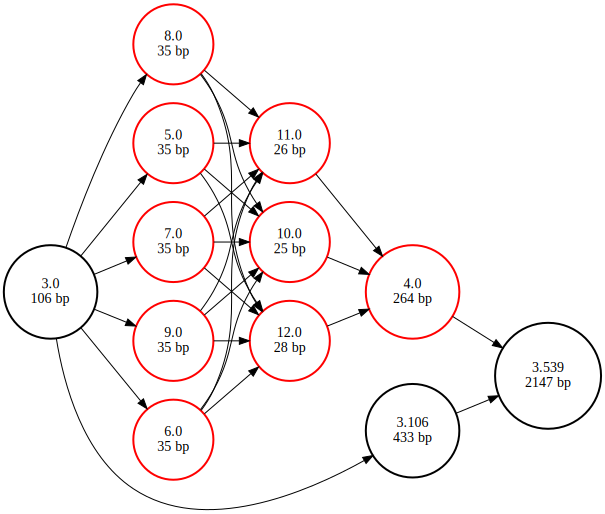

# Combinatorial plasmid design

In this example we will design a library of expression plasmids for _E. coli_. We are looking for the combination of promoter and ribosome binding site that result in the highest expression of an insulin precursor peptide.

We start by setting up a new gen repository and a default database and collection name. This way we don't have to keep specifying which database file and collection to use in the `gen import` and `gen update` commands.

```console
bvh@mbp:~$ gen init

Gen repository initialized.
```
``` console
bvh@mbp:~$ gen defaults --database insulin.db --collection plasmids

Default database set to insulin.db
Default collection set to plasmids
```

Next, we import our base vector from a fasta file.
``` console
bvh@mbp:~$ gen import --fasta puc19.fa

Created it
```

By importing the sequence we have created one new block group and one new path. These are comprised of two edges from the source node to the start of the imported sequence node, and from the end of the imported sequence node to the sink node. We can verify this by querying the database _(todo: implement this functionality in gen)_.
```console
bvh@mbp:~$ sqlite3 --header insulin.db

SQLite version 3.39.5 2022-10-14 20:58:05
Enter ".help" for usage hints.

sqlite> select * from block_group;
id|collection_name|sample_name|name
1|plasmids||M77789.2

sqlite> select * from path;
id|block_group_id|name
1|1|M77789.2

sqlite> select * from edges;
id|source_node_id|source_coordinate|source_strand|target_node_id|target_coordinate|target_strand|chromosome_index|phased
1|1|0|+|3|0|+|0|0
2|3|2686|+|2|0|+|0|0

sqlite> .quit
```

We see that both the path and the block group are called M77789.2, is accession ID for the pUC19 plasmid, which was extracted from the fasta header. Next, we will prepare a _gen update_ operation to insert the insulin operon variants into the vector, more specifically between position 106 and 539. We need two files to specify the design: a _parts_ file that contains the sequences of all of the genetic parts that go into the design, and a _library_ file that describes how the parts should be arranged. 

The library file is a simple CSV table without headers, where each column represents a 'slot' in the construct, and the rows represent the possible parts to include in each slot. Gen will create a combinatorial design where all options for each slot are combined with all options for the other slots. In the example below we have 3 slots, with respectively 5, 2, and 1 part options, this results in 10 possible outcomes (5x2x1).

<table align="center">
<th colspan="3" style="text-align:center">design.csv</th>
<tr>
<td>BBa_J23100</td>
<td>BBa_B0030</td>
<td>proinsulin</td>
</tr>
<tr>
<td>BBa_J23101</td>
<td>BBa_B0032</td>
<td> </td>
</tr>
<tr>
<td>BBa_J23102</td>
<td>BBa_B0034</td>
<td> </td>
</tr>
<tr>
<td>BBa_J23103</td>
<td> </td>
<td> </td>
</tr>
<tr>
<td>BBa_J23104</td>
<td> </td>
<td> </td>
</tr>
</table>

If you create this file by hand outside of a spreadsheet program, please ensure that empty cells are still be separated by commas. We can then run the update operation using the following command:


```console
bvh@mbp:~$ gen update --path-name M77789.2 --start 106 --end 539 --library design.csv --parts parts.fa
```

This update operation did not create new block groups or paths, it only created new edges in the existing block group. You can verify this by running the queries described above, or by rendering a graphical representation of the block group.

## Visualizing the library
We start by exporting our block group to a GFA file that can be used by graph handling software like vg. The gen 'export' command can take a sample name as argument if you only want to export the block group associated with a specific sample, but in this case we just have one block group and it is not associated with any sample.

```console
bvh@mbp:~$ gen export --gfa library.gfa
```

We will use the vg tools using Docker, which we will start as follows to automatically download the vg Docker image, and bind the current working directory to the /data directory in the Docker container.

```console
bvh@mbp:~$ docker run --volume $PWD:/data --workdir /data --interactive -t quay.io/vgteam/vg:v1.60.0
```

Once we're inside the container, we still have to install the graphviz suite to render our images to SVG format.

```console
root@e97629b542ca:/vg# apt install -y graphviz
```

Then we run `vg view` and pipe its output to the `dot` program, which was installed as part of graphviz.
```console
root@e97629b542ca:/vg# vg view --gfa-in library.gfa --dot --color --simple-dot | dot -Tsvg -o library.svg
```

This results in the following image, in which the new nodes are highlighted in red. Nodes 1, 9, and 3 are the promoters; nodes 7, 8 and 2 are ribosome binding sites. The original pUC19 sequence is also visible as the path over nodes [4, 5, 6].


Note that VG uses its own numbering for the nodes. To find out which gen nodes these correspond to, run the following series of commands instead:

```console
root@e97629b542ca:/vg# vg convert --gfa-in library.gfa --gfa-trans translation_table.txt --vg-out | vg view --vg-in - --dot --color --simple-dot | dot -Tsvg -o library.svg 
root@e97629b542ca:/vg# cp library.svg library_fixed.svg && while IFS=$'\t' read _ new old; do sed "s#font-size=\"14.00\">$old</text>#font-size=\"14.00\">$new</text>#g" library_fixed.svg > temp_file.html && mv temp_file.html library_fixed.svg; done < translation_table.txt
```

This results in the following output, where the nodes are referred to by their gen identifier in the block graph model used when exporting to GFA. In this model, nodes are identified by two numbers separated by a period: the first number is the original node identifier in the regular gen model, the number behind the period is the coordinate to where the block starts. Since we asked to insert the library from coordinate 106 to 539 on the reference path, node 3 is split up into 3.0, 3.106 and 3.159 in the block graph model.


