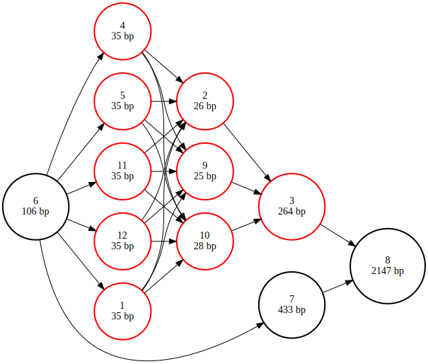

# Combinatorial plasmid design

In this example we will design a library of expression plasmids for _E. coli_. We are looking for the combination of
promoter and ribosome binding site that result in the highest expression of an insulin precursor peptide.

We start by setting up a new gen repository and a default database and collection name. This way we don't have to keep
specifying which database file and collection to use in the `gen import` and `gen update` commands.

```console
$ gen init

Gen repository initialized.
```
``` console
$ gen defaults --database insulin.db --collection plasmids

Default database set to insulin.db
Default collection set to plasmids
```

Next, we import our base vector from a fasta file.
``` console
$ gen import --fasta puc19.fa

Created it
```

By importing the sequence we have created one new block group and one new path. These are comprised of two edges from
the source node to the start of the imported sequence node, and from the end of the imported sequence node to the sink
node. We can verify this by querying the database _(todo: implement this functionality in gen)_.
```console
$ sqlite3 --header insulin.db

SQLite version 3.39.5 2022-10-14 20:58:05
Enter ".help" for usage hints.

sqlite> select * from block_group;
id|collection_name|sample_name|name
1|plasmids||M77789.2

sqlite> select * from path;
id|block_group_id|name
1|1|M77789.2

sqlite> select * from edges;
id|source_node_id|source_coordinate|source_strand|target_node_id|target_coordinate|target_strand|chromosome_index|phased
1|1|0|+|3|0|+|0|0
2|3|2686|+|2|0|+|0|0

sqlite> .quit
```

We see that both the path and the block group are called M77789.2, is accession ID for the pUC19 plasmid, which was
extracted from the fasta header. Next, we will prepare a _gen update_ operation to insert the insulin operon variants
into the vector, more specifically between position 106 and 539. We need two files to specify the design: a _parts_ file
that contains the sequences of all of the genetic parts that go into the design, and a _library_ file that describes how
the parts should be arranged. 

The library file is a simple CSV table without headers, where each column represents a 'slot' in the construct, and the
rows represent the possible parts to include in each slot. Gen will create a combinatorial design where all options for
each slot are combined with all options for the other slots. In the example below we have 3 slots, with respectively 5,
2, and 1 part options, this results in 10 possible outcomes (5x2x1).

<table align="center">
<th colspan="3" style="text-align:center">design.csv</th>
<tr>
<td>BBa_J23100</td>
<td>BBa_B0030</td>
<td>proinsulin</td>
</tr>
<tr>
<td>BBa_J23101</td>
<td>BBa_B0032</td>
<td> </td>
</tr>
<tr>
<td>BBa_J23102</td>
<td>BBa_B0034</td>
<td> </td>
</tr>
<tr>
<td>BBa_J23103</td>
<td> </td>
<td> </td>
</tr>
<tr>
<td>BBa_J23104</td>
<td> </td>
<td> </td>
</tr>
</table>

If you create this file by hand outside of a spreadsheet program, please ensure that empty cells are still be separated
by commas. We can then run the update operation using the following command:


```console
$ gen update --path-name M77789.2 --start 106 --end 539 --library design.csv --parts parts.fa
```

This update operation did not create new block groups or paths, it only created new edges in the existing block group.
You can verify this by running the queries described above, or by rendering a graphical representation of the block
group.

## Visualizing the library
We start by exporting our block group to a GFA file that can be used by graph handling software like vg. The gen
'export' command can take a sample name as argument if you only want to export the block group associated with a
specific sample, but in this case we just have one block group and it is not associated with any sample.

```console
$ gen export --gfa library.gfa
```

We will use the vg tools using Docker, which we will start as follows to automatically download the vg Docker image, and
bind the current working directory to the /data directory in the Docker container.

```console
$ docker run --volume $PWD:/data --workdir /data --interactive -t quay.io/vgteam/vg:v1.60.0
```

Once we're inside the container, we still have to install the graphviz suite to render our images to SVG format.

```console
# apt install -y graphviz
```

Then we run `vg view` and pipe its output to the `dot` program, which was installed as part of graphviz.
```console
# vg view --gfa-in library.gfa --dot --color --simple-dot | dot -Tsvg -o library.svg
```

This results in the following image, in which the new nodes are highlighted in red. Nodes 1, 4, 5, 11 and 12 are the promoters;
nodes 2, 9 and 10 are ribosome binding sites. The original pUC19 sequence is also visible as the path over nodes [6, 7, 8]. 



Note that VG uses its own numbering for the nodes. To find out which gen nodes these correspond to, run the following
series of commands instead:

```console
# vg convert --gfa-in library.gfa --gfa-trans translation_table.txt --vg-out | vg view --vg-in - --dot --color --simple-dot | dot -Tsvg -o library.svg 
# IN='library.svg'; cp $IN ${IN%.*}_fixed.${IN##*.} && while IFS=$'\t' read _ new old; do sed "s#font-size=\"14.00\">$old</text>#font-size=\"14.00\">$new</text>#g" ${IN%.*}_fixed.${IN##*.} > temp_file.html && mv temp_file.html ${IN%.*}_fixed.${IN##*.}; done < translation_table.txt
```

This results in the following output, where the nodes are referred to by their gen identifier in the block graph model
used when exporting to GFA. In this model, nodes are identified by two numbers separated by a period: the first number
is the original node identifier in the regular gen model, the number behind the period is the coordinate to where the
block starts. Since we asked to insert the library from coordinate 106 to 539 on the reference path, node 3 is split up
into 3.0, 3.106 and 3.159 in the block graph model. 

## Searching the library
We can use a sequence-to-graph mapper like [minigraph](https://github.com/lh3/minigraph?tab=readme-ov-file) to search a
block group for the presence of a subsequence, traversing all valid edges if needed. Minigraph is a light weight
application that can be built from source like this:
```console
wget "https://github.com/lh3/minigraph/releases/download/v0.21/minigraph-0.21.tar.bz2" 
tar -xzf minigraph-0.21.tar.bz2 
cd minigraph-0.21
make 
cp minigraph /usr/local/bin/
``` 

Queries are entered via a fasta file. If your query is particularly short you will need to tune minigraph's parameters.
For short queries where you expect an exact match these work well:
```console
minigraph -c  -n 1,1 -m 1,1 library.gfa query.fa
```

## Analysing sequencing data
### Isolate
We will also use minigraph to map longread NGS reads obtained from a single colony isolate:
```console
minigraph -cx lr library.gfa sample1.fq -o sample1.gaf

[M::main::0.000*8.39] loaded the graph from "library.gfa"
[M::mg_index::0.002*3.58] indexed the graph
[M::mg_opt_update::0.002*3.37] occ_max1=50; lc_max_occ=2
[M::worker_pipeline::0.004*2.59] mapped 10 sequences
[M::main] Version: 0.21-r606
[M::main] CMD: minigraph -cx lr -o sample1.gaf library.gfa sample1.fq
[M::main] Real time: 0.005 sec; CPU: 0.012 sec; Peak RSS: 0.002 GB
```

The resulting GAF file has the path to which a read maps listed in the 6th column. We can extract all unique paths that
were identified as follows:
```console
cut -f6 sample1.gaf | sort | uniq

<3.539
<3.539<4.0
>3.0>8.0>10.0>4.0>3.539
>3.539
>4.0>3.539
```

Not all reads cover the graph from end to end, but by looking at the longest path `>3.0>8.0>10.0>4.0>3.539` we are able
to identify the genotype of a colony.

### Pool
Pooled DNA assembly is a great cost-effective way to access a lot of sequence diversity. Instead of making each
combination of parts in a separate sample during cloning, we add all possible parts to a single tube in a one-pot
cloning reaction. Analysing the population of sequences obtained from such a reaction is where long-read NGS and graph
sequence representations really shine.

```console
minigraph -cx lr library.gfa sample2.fq -o sample2.gaf
cut -f6 sample1.gaf | sort | uniq

<3.539
<3.539<3.106
<3.539<3.106<3.0
<3.539<4.0
<3.539<4.0<10.0<6.0<3.0
<3.539<4.0<10.0<7.0<3.0
<3.539<4.0<10.0<8.0<3.0
<3.539<4.0<11.0<5.0<3.0
<3.539<4.0<11.0<6.0<3.0
<3.539<4.0<11.0<7.0<3.0
[...]
```

As you can see in the output above, there are a lot more unique paths present in this sample. One path in particular you
may be interested in is `>3.0>3.106>3.539` or its reverse complement `<3.539<3.106<3.0`, which represent the empty
vector you started out with. For many cloning operations there will always be some carryover of the empty vector. In
conventional cloning this would be eliminated when you create an isolate by picking a single colony, but in pooled
sample you can't do that. This usually isn't a problem, as long as the frequency of empty vector is relative low. We can
measure this by counting the relative occurence of the empty vector paths amongst all observe paths that traverse node
3.0 and 3.539.

```console
total_count=$(cut -f6 sample2.gaf | grep '3\.0' | grep '3\.539' | wc -l)
(.venv) cut -f6 sample2.gaf | grep '3\.0' | grep '3\.539' | sort | uniq -c | awk -v total="$total_count" '{printf "%.2f %s\n", $1 / total * 100, $2}'

27.87 <3.539<3.106<3.0
1.64 <3.539<4.0<10.0<6.0<3.0
1.64 <3.539<4.0<10.0<7.0<3.0
4.92 <3.539<4.0<10.0<8.0<3.0
1.64 <3.539<4.0<11.0<5.0<3.0
1.64 <3.539<4.0<11.0<6.0<3.0
3.28 <3.539<4.0<11.0<7.0<3.0
3.28 <3.539<4.0<11.0<8.0<3.0
1.64 <3.539<4.0<11.0<9.0<3.0
[...]
```

Here we see that approximately 28% of all molecules in the sample are carryover, which isn't great. In a real sample
from a Golden Gate cloning reaction for example this will generally be much lower. Note that we haven't taken into
account any biases to length in this quick analysis.


# Appendix
## Simulating NGS reads using VG
The NGS data used in this example was simulated using the VG toolkit. For the isolate sample we started from a single
sequence and converted that into a graph first: 
```
root@32a61b3f3998:/data# vg construct -r sample1.fa | vg convert --xg-out - > isolate.xg
root@32a61b3f3998:/data# vg sim -x isolate.xg -n 10 -l 2000 -a | vg view --fastq-out - > sample1.fq
```

For the pooled sample we use a GFA file exported by gen. VG doesn't handle lowercase nucleotides, so we convert
everything to uppercase first.
```
root@32a61b3f3998:/data# cat library.gfa | tr 'a-z' 'A-Z' > library_allcaps.gfa
root@32a61b3f3998:/data# vg convert --gfa-in library_allcaps.gfa --xg-out > library.xg 
root@32a61b3f3998:/data# vg sim -x library.xg -n 1000 -l 2000 -a | vg view --fastq-out - > sample2.fq
```