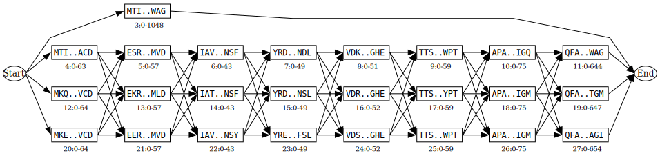

# Tracking protein variant libraries
## Site-directed Homologous Recombination

This example recreates a protein engineering library made through site-directed, homologous recombination guided by
structure-based computation (SCHEMA) ([Otey 2006](https://doi.org/10.1371/journal.pbio.0040112)). Starting from three existing
cytochrome P450 proteins, approximately 3,000 artifical (chimeric) proteins were constructed and tested. The authors
describe it as follows: 

> _"We generated an artificial family of cytochromes P450 by recombining fragments of the genes encoding the
> heme-binding domains of three bacterial P450s, CYP102A1 (also known as P450BM3), CYP102A2, and CYP102A3 (abbreviated
> A1, A2, and A3), which share ̃65% amino acid identity [...] The final design has crossovers located after residues
> Glu64, Ile122, Tyr166, Val216, Thr268, Ala328, and Gln404, based on the numbering of the A1 sequence"_

First we download the sequences of the parent proteins and combine them into one fasta file:

```console
wget https://rest.uniprot.org/uniprotkb/P14779.fasta https://rest.uniprot.org/uniprotkb/O08394.fasta https://rest.uniprot.org/uniprotkb/O08336.fasta
cat O08336.fasta O08394.fasta P14779.fasta > parents.fa
```

Next we create multiple sequence alignment using the Muscle application, which you can run for example through Docker:

```console
 docker run --rm --volume $PWD:/data --workdir /data pegi3s/muscle -in parents.fa -out parents_aligned.fa
```

With this alignment, we can then translate the crossover points from the A1 reference frame to all other proteins. The
msa_crossover.py Python script performs those calculations, creates the protein segments, and saves them to disk in a
format readable by the gen update command. In the future this functionality may be incorporated in the gen client
directly.

```console
python msa_crossover.py parents_aligned.fa 64 122 166 216 268 328 404
```

The default output of this script is a directory called 'output' that contains the files 'layout.csv' and 'segments.fa'.
We now set up our gen repository, create a new branch and switch into it. Then we import one of the parents to have a 
starting point, and perform an update operation. The name of the target path is derived from the fasta file we just
imported, and because it contains | (pipe) symbols we must wrap it in quotes to not confuse the shell. As start and end 
coordinate we choose 0 and 657 because want to replace the entire 1049 residue protein with the combinatorial library.
The parts and library files were obtained by running the msa_crossover.py script as shown above, and the resulting
modifications will be stored as a new virtual sample called schema_library. Lastly, we export that sample to a GFA file.

```console
$ gen init
$ gen defaults --database protein_engineering.db --collection protein
$ gen branch --create ex1
$ gen branch --checkout ex1
$ gen import --fasta P14779.fasta
$ gen update --path-name "sp|P14779|CPXB_PRIM2" --start 0 --end 1049 --parts output/segments.fa --library output/layout.csv --new-sample schema_library
$ gen export --sample schema_library --gfa P450_chimera.gfa
```

This results in a graph with a segment topology as shown below. Each segment is shown as a rectangle containing an
abridged version of its sequence. The node ID from which a segment was derived is indicated on the left side of each
segment, and the linear coordinates within that node are listed above each segment. Segments derived from the same
original node are connected via a dashed line. 

The figure above was generated using [this Python notebook](../../docs/figures/generate_dot_files.ipynb), alternatively
you can use VG to generate a graphical representation. To do this, we export the graph to a GFA file, which can then be
read by VG. One challenge is that VG overwrites our node identifiers. These can be restored by operating as follows:
```console
$ docker run --volume $PWD:/data --workdir /data --interactive -t quay.io/vgteam/vg:v1.60.0
[...]

```
And then once you're inside the Docker container:
```console
# apt update
# apt install -y graphviz
# vg convert --gfa-in P450_chimera.gfa --gfa-trans translation_table.txt --vg-out | vg view --vg-in - --dot --color --simple-dot | dot -Tsvg -o P450_chimera.svg
# IN='P450_chimera.svg'; cp $IN ${IN%.*}_fixed.${IN##*.} && while IFS=$'\t' read _ new old; do sed "s#font-size=\"14.00\">$old</text>#font-size=\"14.00\">$new</text>#g" ${IN%.*}_fixed.${IN##*.} > temp_file.html && mv temp_file.html ${IN%.*}_fixed.${IN##*.}; done < translation_table.txt
```

BUG: GFA export is currently broken (no links are written, only segments and paths)

This results in the following image: 

Now that we have our protein graph ready, we can use it to design a corresponding DNA graph with the same topology, for
example. 

## Site Saturation Mutagenesis
In the next example we will demonstrate the representation of a Site Saturation Mutagenesis library in gen by recreating
an experiment described in ([Wu 2016](https://doi.org/10.7554/eLife.16965)):

> _"In this study, we investigated the fitness landscape of all variants (20^4 = 160,000) at four amino acid sites (V39,
> D40, G41 and V54) in an epistatic region of protein G domain B1 (GB1, 56 amino acids in total)"_

We start by switching back to the main branch and creating a new experimental branch. Then we download the reference 
sequence of the B1 domain of immunoglobulin G-binding protein G found in _Streptococcus_, and import it into our new 
branch. We conclude by listing the branches of our repository, which shows that we have so far run 3 operations in the 
repository overall, with operation 3 taking place in branch `ex2`: 

```console
$ gen branch --checkout main
$ gen branch --create ex2
$ gen branch --checkout ex2
$ wget https://www.rcsb.org/fasta/entry/1PGA -O GB1.fa
$ gen import --fasta GB1.fa
$ gen branch --list

   Name                             Operation           
   ex1                              2                   
>  ex2                              3                   
   main                             -1          
```

To mutagenize the 4 different sites we will perform 4 separate update operations, all sharing the same parts and layout.
The [parts file](saturation_parts.fa) defines a sequence of length 1 for every amino acid, and the [layout file](saturation_layout_single.csv) 
is just one column that lists the same parts by name. Please note that gen uses 0-based indexing, so residue 39 is passed
as `--start 38`. 


```console
gen update --path-name "1PGA_1|Chain" --start 38 --end 39 --parts saturation_parts.fa --library saturation_layout_single.csv --new-sample gb1_mut1
gen update --path-name "1PGA_1|Chain" --start 39 --end 40 --parts saturation_parts.fa --library saturation_layout_single.csv --new-sample gb1_mut2
gen update --path-name "1PGA_1|Chain" --start 40 --end 41 --parts saturation_parts.fa --library saturation_layout_single.csv --new-sample gb1_mut3
```

*BUG: the above doesn't work yet (can't select the new sample by path name)*

```console
gen update --path-name "1PGA_1|Chain" --start 38 --end 41 --parts saturation_parts.fa --library saturation_layout_triple.csv --new-sample gb1_mut1
```

*BUG: the above also doesn't work (the reused parts don't get a new node, so you introduce cycles)*

Note: the fasta file from which obtained the GB1 sequence has a non-compliant header that is cut off at the first space
character, hence the name `1PGA_1|Chain` instead of `1PGA_1|Chain A|PROTEIN G|Streptococcus sp. GX7805`. The full protein
sequence can be found at https://www.uniprot.org/uniprotkb/P06654/entry. TODO: extract the domain directly from P06654. 


## Deep Mutational Scanning


The publication _A Comprehensive Biophysical Description of Pairwise Epistasis throughout an Entire
Protein Domain_ ([Olsen 2014](https://doi.org/10.1016/j.cub.2014.09.072)) studies the same GB1 protein, but mutagenises
the entire region.

>  The 55-residue random region was split into 11 cassettes. Oligonucleotides were designed to randomize each codon singly or each codon pair within each cassette.


## Deep Diversification with Printed Oligonucleotides 
AAV Dataset

Bryant et al. Nature Methods 2021 https://www.ncbi.nlm.nih.gov/bioproject/PRJNA673640/
https://github.com/churchlab/Deep_diversification_AAV https://github.com/google-research/google-research/tree/master/aav 


## Natural Variants

The Protein Gym datasets are a good way to demonstrate graph generation starting from MSA. 

```console
git clone https://github.com/fawaz-dabbaghieh/PanPA.git
cd PanPA
pip install setuptools Cython
python setup.py install
cd ..
```

```console
wget https://marks.hms.harvard.edu/proteingym/ProteinGym_v1.1/DMS_msa_files.zip
```

Converting a2m to fasta:

```console
grep -v "^#" input.a2m | sed '/^>/! s/[a-z.]/-/g' > output.fa
```

## Fitness Landscape Inference for Proteins (FLIP) 
Another commonly referenced open source dataset

## Inscripta example
Dewachter et al. 

Includes NGS counts

TODO: demonstrate DNA <-> protein graph conversion (same topology)


# Bibliography
Dewachter, L., Brooks, A.N., Noon, K. et al. Deep mutational scanning of essential bacterial proteins can guide
antibiotic development. Nat Commun 14, 241 (2023). https://doi.org/10.1038/s41467-023-35940-3

Otey, C. R., Landwehr, M., Endelman, J. B., Hiraga, K., Bloom, J. D., & Arnold, F. H. (2006). Structure-guided
recombination creates an artificial family of cytochromes P450. PLoS biology, 4(5), e112.
https://doi.org/10.1371/journal.pbio.0040112 

Wu, N. C., Dai, L., Olson, C. A., Lloyd-Smith, J. O., & Sun, R. (2016). Adaptation in protein fitness landscapes is
facilitated by indirect paths. Elife, 5, e16965.  https://doi.org/10.7554/eLife.16965


    