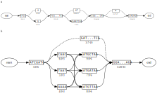

# Introduction

The conventional digital representation of a genetic sequence as a string of characters assumes that a species is
sufficiently defined by a single reference genome. As whole genome sequencing has become more accessible, limitations of
this model have become increasingly apparent. The field of _pangenomics_ has emerged in response, bringing software
tools and data models that represent genetic diversity from thousands of individuals at once in the form of a graph
structure [@eizengaPangenomeGraphs2020]. Thus far, these tools have been predominantly applied to fundamental biology,
but a similar problem exists in engineering biology. Developing a microbial strain, plant cultivar, cell line, or
engineered protein also involves hundreds to thousands genetic variants obtained from environmental samples, breeding,
mutagenesis, or genetic engineering. An additional challenge for genetic engineering is the distinction between
_observed_ and _intended_ sequence variants. Digital tools tend to emphasize one type over the other: a synthetic
biology workflow may involve DNA sequencing to confirm that an intended genome edit took place, but discard any
additonal observed mutations. Likewise, a variant calling pipeline may identify all observed mutations, but lose the
engineering context.

Sequence management in engineering biology is further complicated by the iterative nature of the development process.
Organisms or biological parts are commonly subject to multiple, sequential rounds of engineering to arrive at a desired
state. Pangenomes are an underutilized but highly useful tool for modeling iterative engineering. A graph structure can
also represent sequence edits made over time, in addition to the variants that are studied in one experiment. However,
the existing data models are not optimal for representing this type of iterative engineering. Thus, we set out on a data
model which could be a common, growable database of both reference and sample-specific sequences.

While not directly related to pangenomes, we saw another opportunity to couple graph models with another common need in
synthetic biology -- tracking the engineering process itself. The current state of sharing the evolution of a strain to
its final state is ad-hoc. We saw that the addition of variants to a graph can be captured as a set of changes. And if
we can annotate these sets of changes, we are able to devise a version control system for genetic sequences analogous to
_git_ in software engineering. Such a system enables workflows common in software engineering, such as continuous
integration and code review. Additionally, this naturally links the process of genetic engineering with tracking the
work that was done. This provides an easier path for follow-up work such as patent applications and regulatory
compliance.

For these two purposes, Gen was created. Gen offers a growable database of tracking changes to a sequence. Changes are
recorded and can be gathered into a patch, allowing for sharing of work, code review, and testing. Other git-like
functions are also included, such as the ability to create new branches and merge work across branches. Thus, teams can
work in parallel and incorporate changes across branches when necessary. Gen is written in rust and binaries are
available for Linux and OSX platforms.

# Methods

## Graph Representation

Fundamentally, Gen's data model is similar to most graph models where sequences are encoded as vertices with edges
connecting sequences in various orientations. Gen expands on this common model by defining an edge as a connection
between positions and strands within nodes. This enables Gen to model changes in an append-only mode, where changes to
the graph require only addition of data. This is a significant advantage, as the traditional model requires splitting
nodes into sub-nodes when changes are made, introducing computational overhead for many operations (fig. X).

{starred=true}

On importing data, Gen creates a Sequence object, which is a unique database entry. Nodes are then created which
reference a slice of the stored Sequence. This separation has several uses. One is data compression where the same
sequence or subsequence may be referenced by multiple nodes. The other is to resolve cases where an identical sequence
is referenced multiple times within the same graph. For instance, if multiple copies of the same sequence are repeated,
without the node intermediate, Gen would create an unintentional loop by creating an edge between the same sequence.
Instead, Gen creates a node for each repeat, with a unique edge between each. In this way gen can faithfully represent
duplicate segments.

As previously mentioned, updates to the graph requires only the addition of new data. There are no updates required.
Insertions or replacements of sequence is represented by creating a new sequence, a corresponding node, and two edges (
fig. [graph_updates a](graph_updates/final.svg)). The first edge has its source as the start of the region being
replaced (or the coordinate of the insertion start) on the source node, and its target as the start of the created node.
The second edge has its source as the end of the created node, and its target as the end of the region being replaced
(or the coordinate of the insertion start plus one).

Deletions can be encoded as just one new edge, from the start coordinate of the region being deleted to the end
coordinate of that region [graph_updates b](graph_updates/final.svg)).

Gen represents one contig, such as a chromosome, using one directed graph of nodes and edges. This grouping is termed a
Block Group and a join table between Block Groups and Edges is used to record all the edges in a block group. Because of
the additive nature of insertions, replacements, and deletions, block groups can only grow over time. The block group
represents all possible sequences that can be generated from the graph.

An example of importing a fasta and applying a vcf is used to show these formats are translated into the Gen data model
(fig. [import_example](import_example/final.svg)). First, for each record such as chr1 and chr2, a node is created of
the entire sequence. Two new edges are added to the new node, connecting the start of the sequence to a source node and
the end to a sink node. These nodes are used to simplify the process of finding the starts and end of a graph. When a
vcf is applied, for non-deletions, a new node is created with the alternative sequence and two new edges are created --
an edge from the reference sequence's source node (such as chr1) to the new node, and an edge from the end of the new
node back to the reference sequence. For deletions, only a new single edge is required to represent the new path.

## Graph Traversal

Several conventions and models are used to facilitate graph traversal. Problems that are common in biological sequence
graphs are: having a defined beginning and end point, predefined paths, and indexing into the graph.

Without a defined beginning and end point, traversing a graph requires enumerating all nodes and edges and identifying
which have no incoming edges (start nodes) and which have no outgoing edges (end nodes). To facilitate this, Gen defines
a virtual start node and a virtual end node to avoid enumerating all nodes to identify starts and ends. On imports and
updates, edges are added to these virtual nodes as needed.

Next, several paths are commonly used in a graph, such as the sequence and coordinates corresponding to the reference
genome. Paths specify an ordered list of edges to traverse, from a start node to an edge node. Paths have a unique name
per collection and sample, meaning the chr1 path can exist only once within a sample.

While paths are able to provide paths from the beginning to the end of a graph, it is just as useful to index within a
graph. Accessions provide a system for relative coordinates within a graph. An accession is a named list of ordered
edges within a graph. Accessions are almost identical to paths but do not have to run from a start node to end node.
Common use of accessions are to identify useful regions in a graph, such as landing pads for genetic modification or
genes of interest.

## Phasing, Ploidyness, and Haplotypes

While we continually add new edges, we need to indicate which edges belong together. Phasing is supported and changes on
the same chromatid will be exported together. Phasing is stored as the chromosome_index field, xx, and yyy.

A similar need for phasing is within combinatorial assembly. This is where a set of parts are engineered in series,
leading to a massive diversity of end products. However, in many cases users want a desired set of paths through these
parts. This is another form of phasing, where a set of parts are linked together much like a haplotype.

To support both of these cases, the concept of a phase layer is utilized. A phase layer groups together variants
representing both haplotypes and linked parts.

## Data Organization

Data is stored in on-disk sqlite database files that act as compartmentalized repositories. Within each database file,
Gen has 3 mechanisms for faceting data -- a graph name, a sample, and a collection. The name of a graph refers to its
underlying biological identity as polynucleotide or polypeptide; the sample identifies a specific variation or instance
of the graph; and a collection groups a set of graphs together. Practically this means that "chromosome I in sample S1"
is a different object than "chromosome I in sample S2", and one graph can be modified without forcing the change to
propagate to the other. But because both graphs share a common universe of node and edge identifiers, variants and
annotations can still be easily compared or propagated between samples if desired.

The interpretation of the sample facet is flexible by design. Depending on the application domain or needs of the user a
sample could refer to a physical specimen or individual, for example, but also an environmental population or pool of
experimental samples. Samples do not have to have a counterpart in the physical world, they can be purely virtual and
refer to a digitally designed sequence or model-derived screening library. Multiple graphs can be associated to the same
sample (e.g. all chromosomes in a genome), but not every graph has to be associated with a sample. If it is not, that
graph is said to be part of the _null_ sample.

## Updating the Graph

Updating a graph has varying levels of difficulty. Linear sequences can be indexed in an intuitive way by coordinates
whereas graphs are indexed by nodes. Sequence graphs are difficult to refer to specific positions within the graph
because positions are dependent upon the edges traversed to each position. Thus, the trivial graph with only a single
path can be treated like a linear sequence, but graphs full of heterozygous changes require far more effort as changes
of unequal length create ambiguity into positions conditionally on which edges were traversed. For this, various
approaches are possible to address the increasing levels of complexity. Where possible, existing standards were used or
expanded upon.

A vcf file of alternative alleles can be used to incorporate changes with multiple samples supported. Accessions may
also be encoded into the VCF file via the INFO tag, where the GAN and GAA tag can be used to provide the accession name
and the allele index for the named accession (fig. [vcf_example a](vcf_example/final.svg). If an accession has been
made, it can be used in subsequent changes to refer to a relative region within the graph ((fig. [vcf_example b]
(vcf_example/final.svg))

A graph alignment format (GAF) can be used to insert aligned sequences into the graph (fig. [gaf_example]
(gaf_example/final.svg). Here, a csv file can be used to provide anchoring sequences to identify a position for a change
to be inserted between. The transform command will take this csv, and produce a fasta file that can be aligned via
available graph alignment tools such as minigraph or vg. Then, the resulting GAF and csv file can be provided to the
update command to apply these changes to the graph. Additionally, the GAF file can be manually edited to fine tune the
precise update location as graph aligners may not fully match what users want.

A graphical fragment assembly (GFA) can be used to augment a graph. Here, xxxx.

For simple graphs such as a plasmid or haploid organisms where linear indexing is possible, a fasta file may be provided
to insert its contents ito a given position.

For pooled updates, a custom library format may be provided.

A GenBank file can be provided with changes annotated. Currently, we only support changes encoded in the Geneious
format.

## Sample Lineage

Gen represents lineage across updates and other operations using samples. For instance, importing a fasta file into a
new collection creates the null sample with block groups for each contig. If we then update that collection with a vcf
file, gen creates new samples specified in the vcf, and any new sample in the vcf is created as a child of the null
sample. Gen copies any graph data created by the fasta import in the null sample over to each child sample before
applying the updates specified for each sample.

Using samples seems to be the best fit for tracking lineage, instead of say updating block groups with new information
within an existing sample. A sample can be used to capture the two main use cases for gen operations: Intended edits,
and observed variations. An intended edit can be represented by updating an existing sample using say a fasta file plus
a region and coordinates. That operation would capture the integration of a cassette, and create a new sample with a
path that represents the updated sequence. That new sample would be "virtual" in the sense that it doesn't exist in the
real world, but is treated by gen as separate from any real world samples, which seems appropriate. Observed variations
can be represented by updating an existing sample using say a vcf file. That operation will create new samples, each of
which represents variations observed during sequencing. In this way, gen spans both intended and unintended genetic
changes, and can be used to track changes across repeated cycles of development and testing.

## Pooling

Add details about how gen represents pooling.

## Operations

There are various methods to change a graph, which we term an operation. Each command that alters the data model such as
update or import is recorded as an operation. Operations are analogous to a commit in git and many git-like
functionalities are present in Gen.

Branches allow work to be carried out in parallel. By default, Gen creates a main branch operations are recorded
against. Operations form a simple tree structure, with each operation having a single parent operation at this time.
Branches may be created off any operation, and nested branches are supported. Branches can be merged into one another
via the merge command. This workflow enables parallel work by teams and easy experimentation. Operations may be reverted
and individual operations can be applied across branches, similar to the git cherry-pick command (fig
[operations_view](operations_view/final.svg)).

A set of operations can be collected into a patch, which is analogous to the git patch which represents a diff of how
the codebase is changed (fig. [dot_example](dot_example/final.svg)). However, due to the purely additive data model of
Gen, diffs are much simpler to create as there are no rewrites. Patches are stored as a gzip file and can be shared to
distribute changes. Viewing of patches is possible via the patch-view command, which will render a dot graph of changes
within the patch. By commiting these patches and changes into git, this workflow enables many features common to
software development such as code review and continuous integration testing.

## Translating coordinate schemes

Annotations can be propagated through the graph structure. Thus, annotations on the reference genome can be translated
into the coordinates of new samples. Coordinates are translated with the following rules:

- If the start and end of the annotation range on the reference map to valid coordinates on the sample sequence, gen
  translates the entire annotation to the later sample. Gen does this even if there is a gap in the middle of the later
  sequence that doesn't correspond to anything in the reference sequence, say if a subsequence were replaced.
- If say the start of the range translates to a valid coordinate on the later sample, but the end does not (say because
  a replacement wiped out the stretch of the reference sequence that contained the end), gen truncates the translated
  annotation range to only include the stretch of sequence that the reference shares with the later sample.

## Exports

A design goal of Gen was to not replace existing formats, but to complement them. Gen can export its data into a variety
of formats for subsequent use by 3rd party tools. Because graphs can vary significantly in their complexity, several
export options are available to accommodate the varying degrees.

Graphs can be exported into the Graphical Fragment Assembly (GFA) format. Nodes in the Gen graph are translated into GFA
segment ids and paths are exported as well. Gen nodes are converted into segments by concatenating the Gen node id with
the sequence coordinates the node maps to. For example, node 5 which references positions 9-20 of a sequence will be
exported as 5.9.20. The lineage of a sample can also be encoded as a GFA file, where changes from a parent sample to a
descendent will be exported. This is incredibly useful for representing and tracking iterative strain engineering.

Simple graphs can be exported into a GenBank format. Due to the limited information encoded in GenBanks, only simple
graphs such as plasmid or haploid samples will produce a meaningful output. The data export for GenBank currently uses
the Geneious conventions for encoding changes to a sequence, so data can be imported and exported into Geneious for
sequence editing.

Paths within a graph may be exported to a fasta format. This is commonly used to generate a fasta file of a reference
genome or simple graphs where changes are unambiguous (for example, changes to a haploid organism).

## Database

Gen uses a sqlite database. Sqlite was chosen because it is extensively used across all major platforms. It is
additionally a local database, enabling users to use gen without having to set up more complicated databases or require
an internet connection to a cloud service. Sqlite also allows extensibility of the data model via schema migrations and
users can extend the Gen model with new tables to add custom functionality if desired. Updates to gen will be possible
with schema migrations, which help mitigate the version issues plaguing many bioinformatic data formats.

Another consideration for sqlite is it can be accessed via web assembly (WASM), meaning databases stored in places such
an Amazon s3 bucket can be accessed without any dedicated servers. Thus, applications can be developed and ran entirely
on the client side.

# Results

## Performance Benchmarks

While extensive benchmarking and performance tuning has not been carried out, owing to the use of Rust, Gen is fairly
performant without much attention to optimizations. 1000 genomes data. Time for variant updates, size on disk of db.

| Task                                                                          | Time     | Storage        |
| ----------------------------------------------------------------------------- | -------- | -------------- |
| Importing GrCh38 (shallow)                                                    | 7s       | 496kb          |
| Importing GrCh38 (full)                                                       | 49s      | 3.0 Gb         |
| Adding variants from chr22 of 1000 genomes project (HG00096 sample)           | 11s      | 22.9 Mb        |
| Adding variants from chr22 of 1000 genomes project (HG00096 + HG00097 sample) | 11s + 6s | 22.9 + 11.7 Mb |

- the gzipped vcf input file was 17Mb for each sample, more samples lead to less data created as fewer new edges are
  needed

translating annotations

data export time

# Discussion

- The lack of a growable database. Minor changes required regenerating the entire graph and re-exporting it. Graph
  genomes grow at a rate faster than a linear alignment. For example, a single copy of hg38 sufficies for analyses of
  many samples. Whereas with sample specific graphs, each sample requires its own graph as an additional tracked asset.
  This also made it difficult to compare across analyses, as nodes which may be in common between two graph samples
  would have different labels. This could be mitigated by creating a graph encompassing all samples, but this approach
  simply delays the inevitable addition of a new sample, a derivative lineage, or an updated set of variant calls.

## Removed sections

## Coordinates and indexing

Coordinates in gen are 0-based, and ranges are closed/open. For instance, (0, 5) represents the first five base pairs of
a sequence, and (10, 11) represents the eleventh base pair.

-

# References
